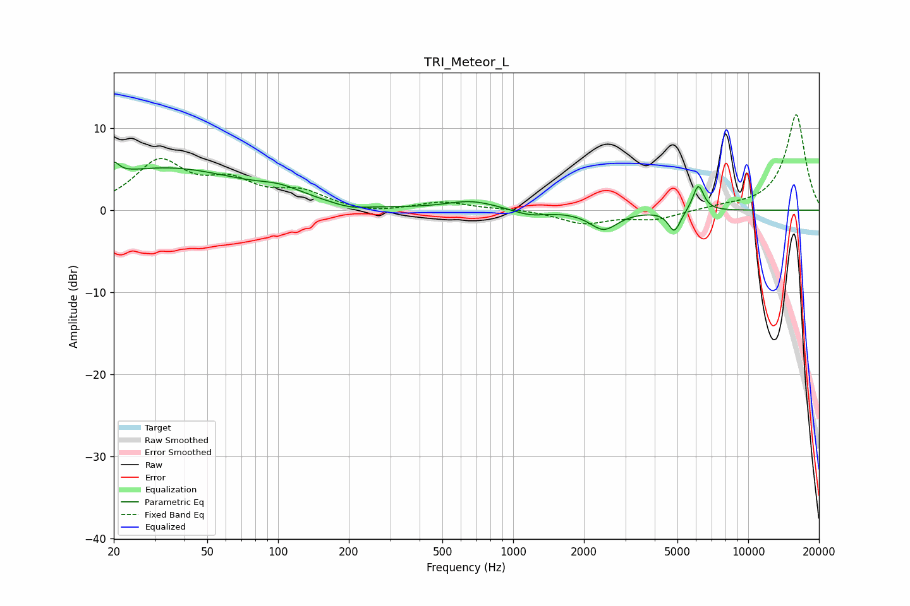

# TRI_Meteor_L
See [usage instructions](https://github.com/jaakkopasanen/AutoEq#usage) for more options and info.

### Parametric EQs
Apply preamp of -5.9 dB when using parametric equalizer.

|   # | Type    |   Fc (Hz) |    Q |   Gain (dB) |
|-----|---------|-----------|------|-------------|
|   1 | Peaking |        20 | 6    |         4.9 |
|   2 | Peaking |        20 | 6    |        -3.3 |
|   3 | Peaking |        33 | 0.42 |         5   |
|   4 | Peaking |       103 | 1.45 |         1   |
|   5 | Peaking |       202 | 1.97 |        -0.5 |
|   6 | Peaking |       665 | 1.3  |         1.1 |
|   7 | Peaking |      1176 | 1.97 |        -0.7 |
|   8 | Peaking |      2430 | 2.38 |        -2.3 |
|   9 | Peaking |      4852 | 5.39 |        -2.6 |
|  10 | Peaking |      6132 | 5.9  |         3.3 |

### Fixed Band EQs
When using fixed band (also called graphic) equalizer, apply preamp of **-11.7 dB** (if available) and set gains manually with these parameters.

|   # | Type    |   Fc (Hz) |    Q |   Gain (dB) |
|-----|---------|-----------|------|-------------|
|   1 | Peaking |        31 | 1.41 |         5.7 |
|   2 | Peaking |        62 | 1.41 |         2.9 |
|   3 | Peaking |       125 | 1.41 |         2   |
|   4 | Peaking |       250 | 1.41 |        -0.5 |
|   5 | Peaking |       500 | 1.41 |         1   |
|   6 | Peaking |      1000 | 1.41 |         0.2 |
|   7 | Peaking |      2000 | 1.41 |        -1.6 |
|   8 | Peaking |      4000 | 1.41 |        -1.1 |
|   9 | Peaking |      8000 | 1.41 |         0.3 |
|  10 | Peaking |     16000 | 1.41 |        11.7 |

### Graphs

