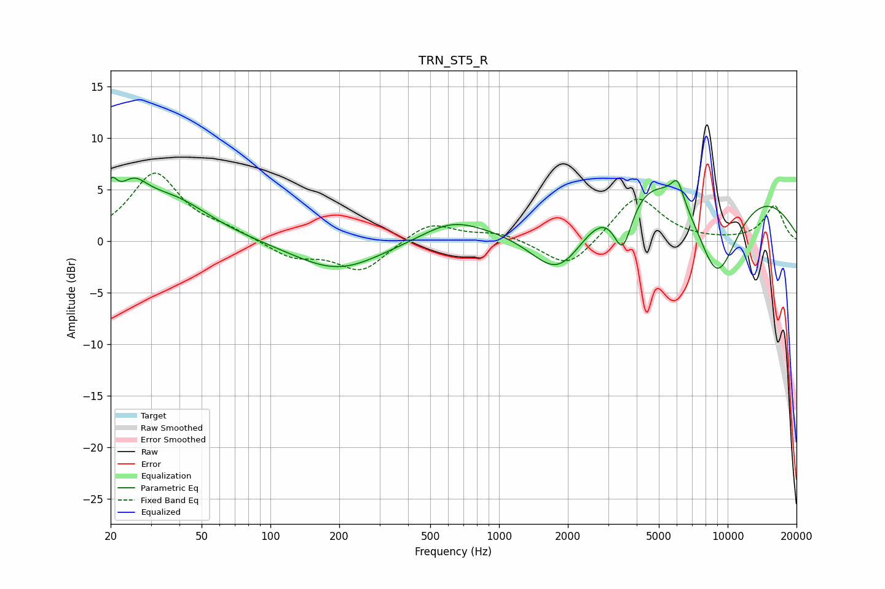

# TRN_ST5_R
See [usage instructions](https://github.com/jaakkopasanen/AutoEq#usage) for more options and info.

### Parametric EQs
Apply preamp of -6.3 dB when using parametric equalizer.

|   # | Type    |   Fc (Hz) |    Q |   Gain (dB) |
|-----|---------|-----------|------|-------------|
|   1 | Peaking |        20 | 5.66 |         2.7 |
|   2 | Peaking |        25 | 2.12 |         3.1 |
|   3 | Peaking |        37 | 0.83 |         3.9 |
|   4 | Peaking |       197 | 0.74 |        -2.9 |
|   5 | Peaking |       618 | 1.06 |         1.7 |
|   6 | Peaking |      1839 | 0.98 |        -7.9 |
|   7 | Peaking |      3479 | 3.3  |        -5.3 |
|   8 | Peaking |      6028 | 5.14 |         2.1 |
|   9 | Peaking |      6266 | 0.25 |        10.9 |
|  10 | Peaking |      8944 | 1.04 |       -12.6 |

### Fixed Band EQs
When using fixed band (also called graphic) equalizer, apply preamp of **-6.7 dB** (if available) and set gains manually with these parameters.

|   # | Type    |   Fc (Hz) |    Q |   Gain (dB) |
|-----|---------|-----------|------|-------------|
|   1 | Peaking |        31 | 1.41 |         6.5 |
|   2 | Peaking |        62 | 1.41 |         0.9 |
|   3 | Peaking |       125 | 1.41 |        -1.5 |
|   4 | Peaking |       250 | 1.41 |        -2.9 |
|   5 | Peaking |       500 | 1.41 |         1.9 |
|   6 | Peaking |      1000 | 1.41 |         0.8 |
|   7 | Peaking |      2000 | 1.41 |        -2.8 |
|   8 | Peaking |      4000 | 1.41 |         4.5 |
|   9 | Peaking |      8000 | 1.41 |        -0   |
|  10 | Peaking |     16000 | 1.41 |         3.4 |

### Graphs

