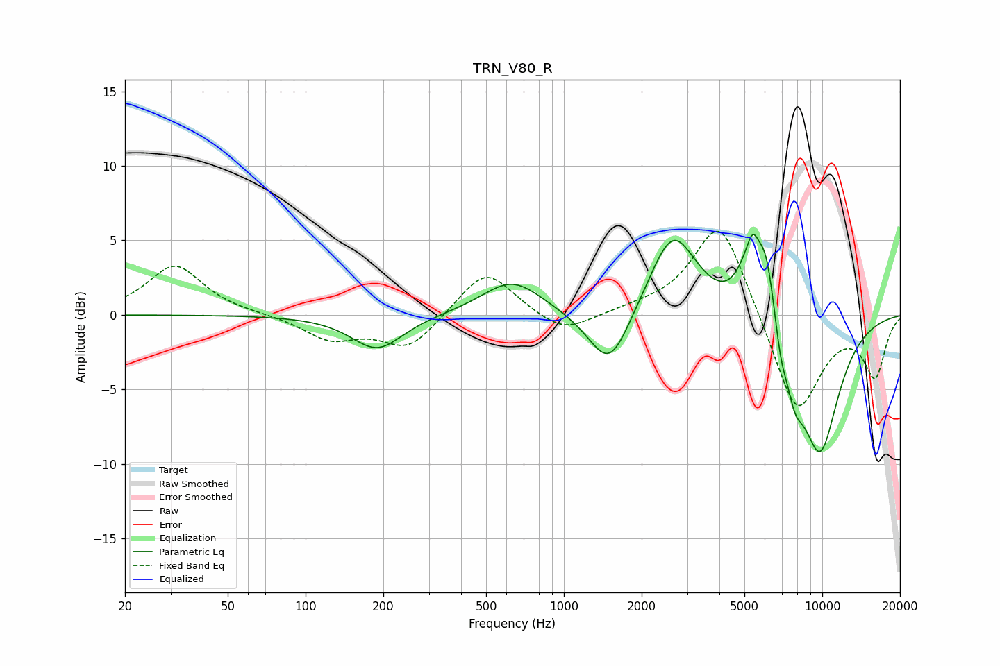

# TRN_V80_R
See [usage instructions](https://github.com/jaakkopasanen/AutoEq#usage) for more options and info.

### Parametric EQs
Apply preamp of -5.5 dB when using parametric equalizer.

|   # | Type    |   Fc (Hz) |    Q |   Gain (dB) |
|-----|---------|-----------|------|-------------|
|   1 | Peaking |       189 | 1.43 |        -2.3 |
|   2 | Peaking |       630 | 1.22 |         2.4 |
|   3 | Peaking |      1502 | 1.74 |        -4.2 |
|   4 | Peaking |      2641 | 1.51 |         5.7 |
|   5 | Peaking |      5080 | 2.98 |         2.2 |
|   6 | Peaking |      5394 | 5.9  |         2.1 |
|   7 | Peaking |      6050 | 3.64 |         4.6 |
|   8 | Peaking |      6907 | 6    |        -1.5 |
|   9 | Peaking |      7822 | 3.65 |        -2.7 |
|  10 | Peaking |      9790 | 1.55 |        -9.1 |

### Fixed Band EQs
When using fixed band (also called graphic) equalizer, apply preamp of **-5.7 dB** (if available) and set gains manually with these parameters.

|   # | Type    |   Fc (Hz) |    Q |   Gain (dB) |
|-----|---------|-----------|------|-------------|
|   1 | Peaking |        31 | 1.41 |         3.3 |
|   2 | Peaking |        62 | 1.41 |         0   |
|   3 | Peaking |       125 | 1.41 |        -1.6 |
|   4 | Peaking |       250 | 1.41 |        -2.3 |
|   5 | Peaking |       500 | 1.41 |         3.2 |
|   6 | Peaking |      1000 | 1.41 |        -1.4 |
|   7 | Peaking |      2000 | 1.41 |         0.3 |
|   8 | Peaking |      4000 | 1.41 |         6.6 |
|   9 | Peaking |      8000 | 1.41 |        -6.9 |
|  10 | Peaking |     16000 | 1.41 |        -4   |

### Graphs

