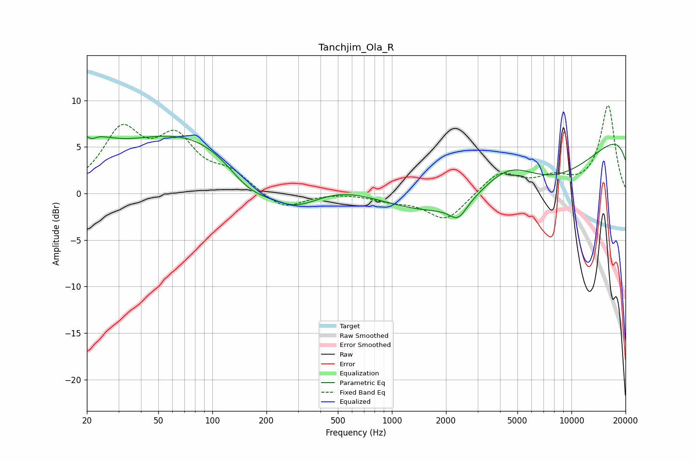

# Tanchjim_Ola_R
See [usage instructions](https://github.com/jaakkopasanen/AutoEq#usage) for more options and info.

### Parametric EQs
Apply preamp of -6.3 dB when using parametric equalizer.

|   # | Type    |   Fc (Hz) |    Q |   Gain (dB) |
|-----|---------|-----------|------|-------------|
|   1 | Peaking |        20 | 1.44 |         4.3 |
|   2 | Peaking |        21 | 5.24 |        -0.9 |
|   3 | Peaking |        23 | 2.5  |        -0.6 |
|   4 | Peaking |       119 | 0.22 |         7.9 |
|   5 | Peaking |       159 | 0.98 |        -3.9 |
|   6 | Peaking |       283 | 0.76 |        -5.7 |
|   7 | Peaking |      2339 | 2.94 |        -1.7 |
|   8 | Peaking |      4436 | 0.8  |         5   |
|   9 | Peaking |      5699 | 0.24 |       -13.7 |
|  10 | Peaking |     10000 | 0.18 |        13.2 |

### Fixed Band EQs
When using fixed band (also called graphic) equalizer, apply preamp of **-9.5 dB** (if available) and set gains manually with these parameters.

|   # | Type    |   Fc (Hz) |    Q |   Gain (dB) |
|-----|---------|-----------|------|-------------|
|   1 | Peaking |        31 | 1.41 |         6.3 |
|   2 | Peaking |        62 | 1.41 |         5.3 |
|   3 | Peaking |       125 | 1.41 |         1.9 |
|   4 | Peaking |       250 | 1.41 |        -1.8 |
|   5 | Peaking |       500 | 1.41 |         0.1 |
|   6 | Peaking |      1000 | 1.41 |        -0.6 |
|   7 | Peaking |      2000 | 1.41 |        -2.9 |
|   8 | Peaking |      4000 | 1.41 |         2.3 |
|   9 | Peaking |      8000 | 1.41 |         1.4 |
|  10 | Peaking |     16000 | 1.41 |         9.4 |

### Graphs

