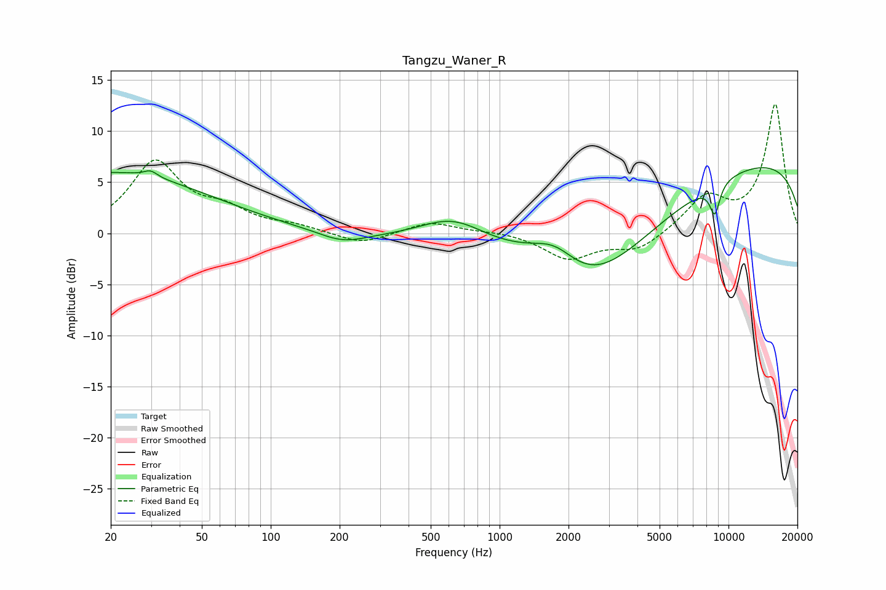

# Tangzu_Waner_R
See [usage instructions](https://github.com/jaakkopasanen/AutoEq#usage) for more options and info.

### Parametric EQs
Apply preamp of -6.5 dB when using parametric equalizer.

|   # | Type    |   Fc (Hz) |    Q |   Gain (dB) |
|-----|---------|-----------|------|-------------|
|   1 | Peaking |        20 | 0.33 |         5.9 |
|   2 | Peaking |        30 | 5.06 |         0.6 |
|   3 | Peaking |       205 | 1.35 |        -1.1 |
|   4 | Peaking |       634 | 0.89 |         3.4 |
|   5 | Peaking |      1260 | 0.79 |         2.4 |
|   6 | Peaking |      1746 | 1.29 |         3.4 |
|   7 | Peaking |      2102 | 0.18 |        -1.3 |
|   8 | Peaking |      2190 | 0.45 |        -9.4 |
|   9 | Peaking |      8713 | 5.77 |        -3   |
|  10 | Peaking |     10000 | 0.18 |         7.7 |

### Fixed Band EQs
When using fixed band (also called graphic) equalizer, apply preamp of **-12.7 dB** (if available) and set gains manually with these parameters.

|   # | Type    |   Fc (Hz) |    Q |   Gain (dB) |
|-----|---------|-----------|------|-------------|
|   1 | Peaking |        31 | 1.41 |         6.8 |
|   2 | Peaking |        62 | 1.41 |         1.8 |
|   3 | Peaking |       125 | 1.41 |         0.6 |
|   4 | Peaking |       250 | 1.41 |        -1.1 |
|   5 | Peaking |       500 | 1.41 |         1.1 |
|   6 | Peaking |      1000 | 1.41 |         0.2 |
|   7 | Peaking |      2000 | 1.41 |        -2.5 |
|   8 | Peaking |      4000 | 1.41 |        -1.7 |
|   9 | Peaking |      8000 | 1.41 |         3.3 |
|  10 | Peaking |     16000 | 1.41 |        12.6 |

### Graphs

