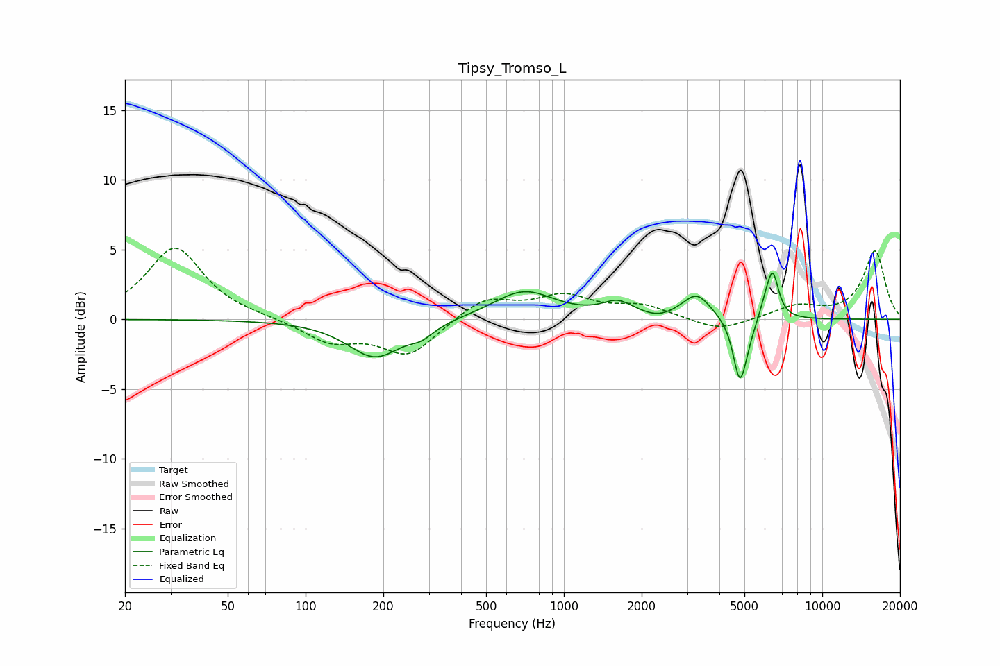

# Tipsy_Tromso_L
See [usage instructions](https://github.com/jaakkopasanen/AutoEq#usage) for more options and info.

### Parametric EQs
Apply preamp of -3.4 dB when using parametric equalizer.

|   # | Type    |   Fc (Hz) |    Q |   Gain (dB) |
|-----|---------|-----------|------|-------------|
|   1 | Peaking |       186 | 1.34 |        -2.7 |
|   2 | Peaking |       282 | 3.07 |        -0.7 |
|   3 | Peaking |       700 | 1.2  |         2.1 |
|   4 | Peaking |      1617 | 2.38 |         1   |
|   5 | Peaking |      2311 | 2.65 |        -0.3 |
|   6 | Peaking |      3266 | 2.56 |         1.8 |
|   7 | Peaking |      4791 | 5.54 |        -4.1 |
|   8 | Peaking |      5056 | 4.38 |        -0.9 |
|   9 | Peaking |      6033 | 6    |         0.8 |
|  10 | Peaking |      6434 | 5.99 |         3.2 |

### Fixed Band EQs
When using fixed band (also called graphic) equalizer, apply preamp of **-5.2 dB** (if available) and set gains manually with these parameters.

|   # | Type    |   Fc (Hz) |    Q |   Gain (dB) |
|-----|---------|-----------|------|-------------|
|   1 | Peaking |        31 | 1.41 |         5.2 |
|   2 | Peaking |        62 | 1.41 |         0.1 |
|   3 | Peaking |       125 | 1.41 |        -1.6 |
|   4 | Peaking |       250 | 1.41 |        -2.6 |
|   5 | Peaking |       500 | 1.41 |         1.6 |
|   6 | Peaking |      1000 | 1.41 |         1.5 |
|   7 | Peaking |      2000 | 1.41 |         0.9 |
|   8 | Peaking |      4000 | 1.41 |        -0.9 |
|   9 | Peaking |      8000 | 1.41 |         0.9 |
|  10 | Peaking |     16000 | 1.41 |         4.9 |

### Graphs

