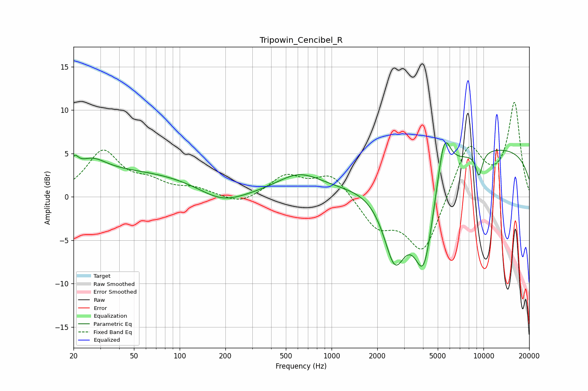

# Tripowin_Cencibel_R
See [usage instructions](https://github.com/jaakkopasanen/AutoEq#usage) for more options and info.

### Parametric EQs
Apply preamp of -6.3 dB when using parametric equalizer.

|   # | Type    |   Fc (Hz) |    Q |   Gain (dB) |
|-----|---------|-----------|------|-------------|
|   1 | Peaking |        20 | 5.6  |         1.4 |
|   2 | Peaking |        26 | 1.49 |         1.8 |
|   3 | Peaking |        47 | 0.27 |         2.9 |
|   4 | Peaking |       189 | 0.92 |        -1.8 |
|   5 | Peaking |       613 | 0.94 |         2.4 |
|   6 | Peaking |      2608 | 1.8  |        -8.8 |
|   7 | Peaking |      4046 | 1.93 |       -11.2 |
|   8 | Peaking |      5498 | 3.16 |         5.9 |
|   9 | Peaking |      9346 | 5.57 |        -2.7 |
|  10 | Peaking |     10000 | 0.18 |         5.8 |

### Fixed Band EQs
When using fixed band (also called graphic) equalizer, apply preamp of **-11.0 dB** (if available) and set gains manually with these parameters.

|   # | Type    |   Fc (Hz) |    Q |   Gain (dB) |
|-----|---------|-----------|------|-------------|
|   1 | Peaking |        31 | 1.41 |         5.1 |
|   2 | Peaking |        62 | 1.41 |         1.4 |
|   3 | Peaking |       125 | 1.41 |         0.8 |
|   4 | Peaking |       250 | 1.41 |        -1   |
|   5 | Peaking |       500 | 1.41 |         2.4 |
|   6 | Peaking |      1000 | 1.41 |         2.7 |
|   7 | Peaking |      2000 | 1.41 |        -3.3 |
|   8 | Peaking |      4000 | 1.41 |        -6.5 |
|   9 | Peaking |      8000 | 1.41 |         6.2 |
|  10 | Peaking |     16000 | 1.41 |        10.7 |

### Graphs

