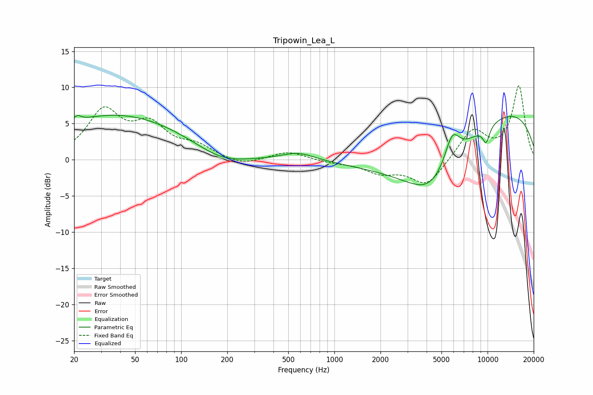

# Tripowin_Lea_L
See [usage instructions](https://github.com/jaakkopasanen/AutoEq#usage) for more options and info.

### Parametric EQs
Apply preamp of -6.2 dB when using parametric equalizer.

|   # | Type    |   Fc (Hz) |    Q |   Gain (dB) |
|-----|---------|-----------|------|-------------|
|   1 | Peaking |        21 | 5.71 |         0.8 |
|   2 | Peaking |        38 | 0.31 |         6.2 |
|   3 | Peaking |       183 | 0.83 |        -1.7 |
|   4 | Peaking |       583 | 1.3  |         1.1 |
|   5 | Peaking |      4012 | 0.41 |        -6.3 |
|   6 | Peaking |      4277 | 0.97 |        -3.9 |
|   7 | Peaking |      5871 | 2.81 |         4.1 |
|   8 | Peaking |      8151 | 0.18 |         2.2 |
|   9 | Peaking |      9790 | 5.32 |        -2.2 |
|  10 | Peaking |     10000 | 0.23 |         5.9 |

### Fixed Band EQs
When using fixed band (also called graphic) equalizer, apply preamp of **-10.3 dB** (if available) and set gains manually with these parameters.

|   # | Type    |   Fc (Hz) |    Q |   Gain (dB) |
|-----|---------|-----------|------|-------------|
|   1 | Peaking |        31 | 1.41 |         6.5 |
|   2 | Peaking |        62 | 1.41 |         4.2 |
|   3 | Peaking |       125 | 1.41 |         1.6 |
|   4 | Peaking |       250 | 1.41 |        -0.9 |
|   5 | Peaking |       500 | 1.41 |         1.1 |
|   6 | Peaking |      1000 | 1.41 |        -0.3 |
|   7 | Peaking |      2000 | 1.41 |        -1.6 |
|   8 | Peaking |      4000 | 1.41 |        -3.6 |
|   9 | Peaking |      8000 | 1.41 |         4.1 |
|  10 | Peaking |     16000 | 1.41 |        10.1 |

### Graphs

