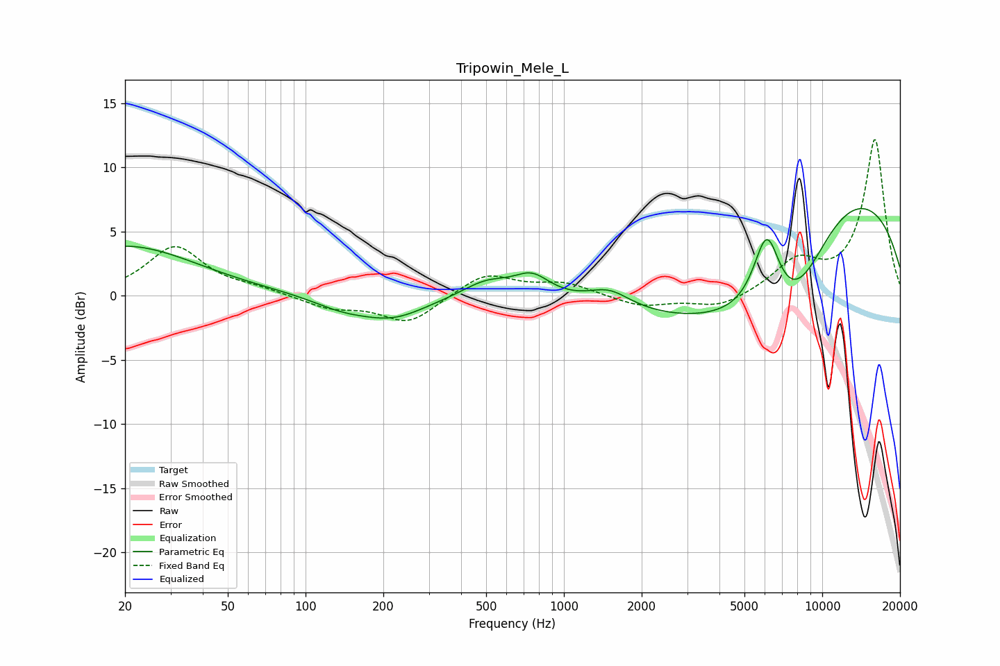

# Tripowin_Mele_L
See [usage instructions](https://github.com/jaakkopasanen/AutoEq#usage) for more options and info.

### Parametric EQs
Apply preamp of -6.9 dB when using parametric equalizer.

|   # | Type    |   Fc (Hz) |    Q |   Gain (dB) |
|-----|---------|-----------|------|-------------|
|   1 | Peaking |        20 | 0.51 |         3.9 |
|   2 | Peaking |       138 | 1.24 |        -0.8 |
|   3 | Peaking |       217 | 1.08 |        -1.6 |
|   4 | Peaking |       501 | 1.49 |         1.3 |
|   5 | Peaking |       752 | 2.02 |         1.7 |
|   6 | Peaking |      1499 | 1.74 |         1.3 |
|   7 | Peaking |      3639 | 0.42 |        -4.2 |
|   8 | Peaking |      6097 | 2.59 |         6.3 |
|   9 | Peaking |      7761 | 0.59 |       -12.1 |
|  10 | Peaking |      9975 | 0.33 |        15   |

### Fixed Band EQs
When using fixed band (also called graphic) equalizer, apply preamp of **-12.3 dB** (if available) and set gains manually with these parameters.

|   # | Type    |   Fc (Hz) |    Q |   Gain (dB) |
|-----|---------|-----------|------|-------------|
|   1 | Peaking |        31 | 1.41 |         3.8 |
|   2 | Peaking |        62 | 1.41 |         0.4 |
|   3 | Peaking |       125 | 1.41 |        -0.9 |
|   4 | Peaking |       250 | 1.41 |        -2.1 |
|   5 | Peaking |       500 | 1.41 |         1.8 |
|   6 | Peaking |      1000 | 1.41 |         0.9 |
|   7 | Peaking |      2000 | 1.41 |        -0.9 |
|   8 | Peaking |      4000 | 1.41 |        -1   |
|   9 | Peaking |      8000 | 1.41 |         2.5 |
|  10 | Peaking |     16000 | 1.41 |        12.2 |

### Graphs

