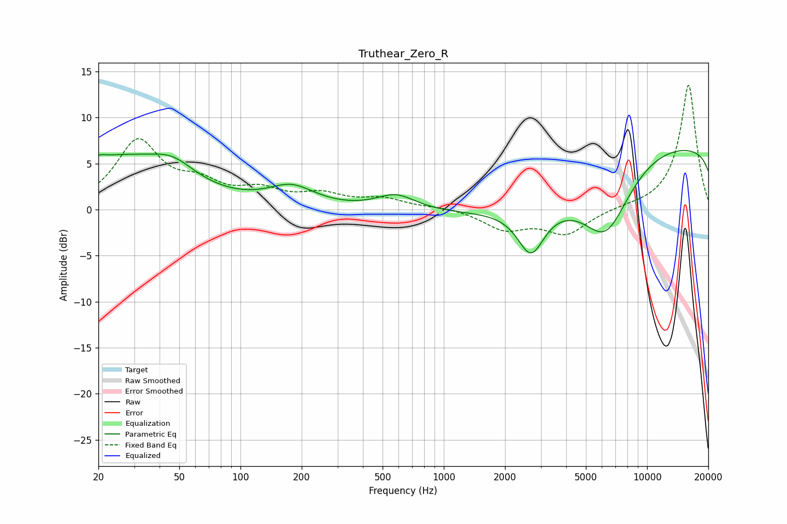

# Truthear_Zero_R
See [usage instructions](https://github.com/jaakkopasanen/AutoEq#usage) for more options and info.

### Parametric EQs
Apply preamp of -6.5 dB when using parametric equalizer.

|   # | Type    |   Fc (Hz) |    Q |   Gain (dB) |
|-----|---------|-----------|------|-------------|
|   1 | Peaking |        20 | 4.78 |         0.4 |
|   2 | Peaking |        24 | 0.48 |         5.4 |
|   3 | Peaking |        46 | 1.33 |         1.9 |
|   4 | Peaking |       177 | 5.08 |         0   |
|   5 | Peaking |       178 | 1.23 |         2.2 |
|   6 | Peaking |       582 | 1.47 |         1.7 |
|   7 | Peaking |      2685 | 2.13 |        -5.1 |
|   8 | Peaking |      6273 | 1.14 |        -7.1 |
|   9 | Peaking |      6607 | 0.18 |       -11.8 |
|  10 | Peaking |      9437 | 0.18 |        18   |

### Fixed Band EQs
When using fixed band (also called graphic) equalizer, apply preamp of **-13.6 dB** (if available) and set gains manually with these parameters.

|   # | Type    |   Fc (Hz) |    Q |   Gain (dB) |
|-----|---------|-----------|------|-------------|
|   1 | Peaking |        31 | 1.41 |         7.2 |
|   2 | Peaking |        62 | 1.41 |         2.2 |
|   3 | Peaking |       125 | 1.41 |         1.8 |
|   4 | Peaking |       250 | 1.41 |         1.4 |
|   5 | Peaking |       500 | 1.41 |         1.1 |
|   6 | Peaking |      1000 | 1.41 |         0.3 |
|   7 | Peaking |      2000 | 1.41 |        -2   |
|   8 | Peaking |      4000 | 1.41 |        -2.6 |
|   9 | Peaking |      8000 | 1.41 |         0.2 |
|  10 | Peaking |     16000 | 1.41 |        13.6 |

### Graphs

