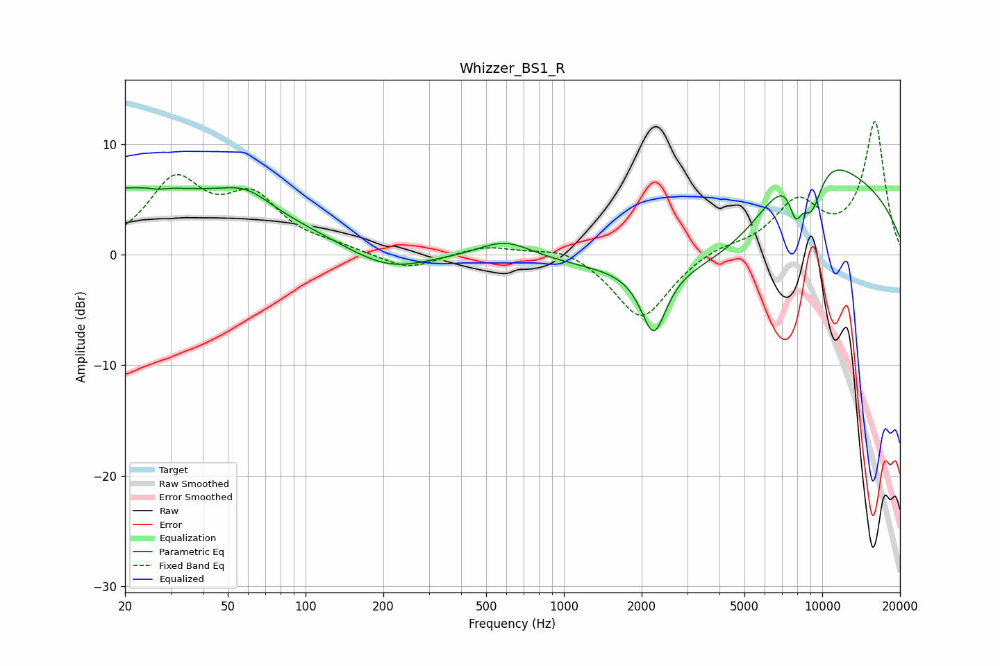

# Whizzer_BS1_R
See [usage instructions](https://github.com/jaakkopasanen/AutoEq#usage) for more options and info.

### Parametric EQs
Apply preamp of -7.7 dB when using parametric equalizer.

|   # | Type    |   Fc (Hz) |    Q |   Gain (dB) |
|-----|---------|-----------|------|-------------|
|   1 | Peaking |        22 | 0.25 |         6   |
|   2 | Peaking |        27 | 5.95 |        -0.2 |
|   3 | Peaking |        59 | 1.48 |         1.6 |
|   4 | Peaking |       208 | 0.94 |        -1.9 |
|   5 | Peaking |       594 | 1.37 |         1.6 |
|   6 | Peaking |      2228 | 2.91 |        -5.9 |
|   7 | Peaking |      5261 | 0.34 |       -11.8 |
|   8 | Peaking |      7893 | 5.02 |        -3.3 |
|   9 | Peaking |      8316 | 0.41 |        20   |
|  10 | Peaking |      9062 | 2.69 |        -5.6 |

### Fixed Band EQs
When using fixed band (also called graphic) equalizer, apply preamp of **-12.1 dB** (if available) and set gains manually with these parameters.

|   # | Type    |   Fc (Hz) |    Q |   Gain (dB) |
|-----|---------|-----------|------|-------------|
|   1 | Peaking |        31 | 1.41 |         6.3 |
|   2 | Peaking |        62 | 1.41 |         4.6 |
|   3 | Peaking |       125 | 1.41 |         0.5 |
|   4 | Peaking |       250 | 1.41 |        -1.4 |
|   5 | Peaking |       500 | 1.41 |         0.8 |
|   6 | Peaking |      1000 | 1.41 |         0.9 |
|   7 | Peaking |      2000 | 1.41 |        -6   |
|   8 | Peaking |      4000 | 1.41 |         0.7 |
|   9 | Peaking |      8000 | 1.41 |         4.5 |
|  10 | Peaking |     16000 | 1.41 |        11.9 |

### Graphs

