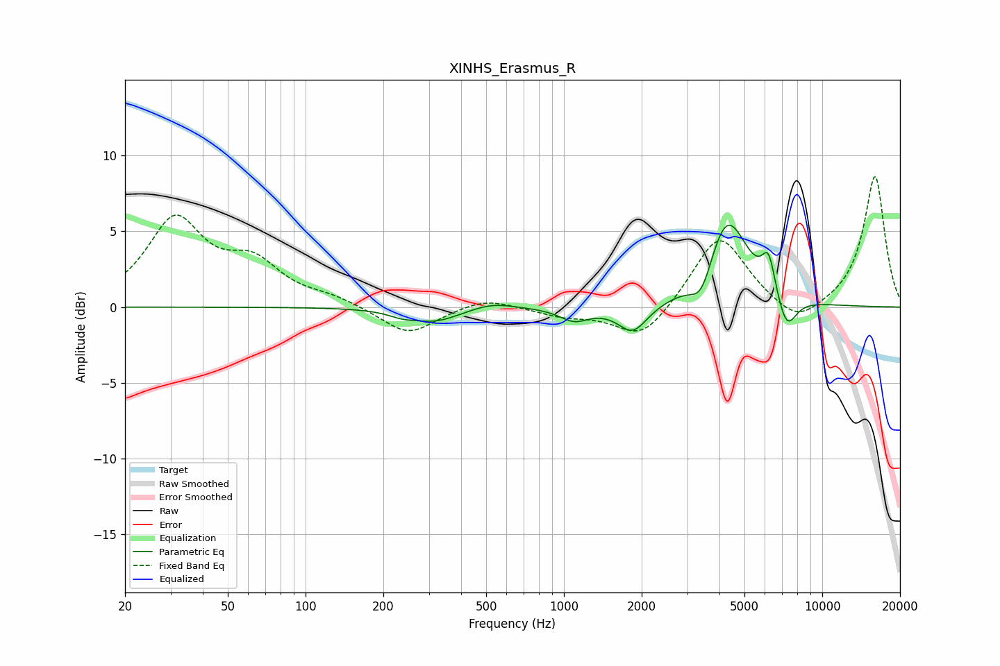

# XINHS_Erasmus_R
See [usage instructions](https://github.com/jaakkopasanen/AutoEq#usage) for more options and info.

### Parametric EQs
Apply preamp of -5.5 dB when using parametric equalizer.

|   # | Type    |   Fc (Hz) |    Q |   Gain (dB) |
|-----|---------|-----------|------|-------------|
|   1 | Peaking |       235 | 2.84 |        -0.3 |
|   2 | Peaking |       317 | 1.42 |        -0.9 |
|   3 | Peaking |       526 | 1.69 |         0.4 |
|   4 | Peaking |      1098 | 2.46 |        -0.9 |
|   5 | Peaking |      1848 | 2.45 |        -1.8 |
|   6 | Peaking |      3417 | 3.15 |        -2.2 |
|   7 | Peaking |      4268 | 1.71 |         6.1 |
|   8 | Peaking |      6203 | 5.23 |         2.5 |
|   9 | Peaking |      7207 | 3.33 |        -1.7 |
|  10 | Peaking |      7378 | 4.06 |        -0.7 |

### Fixed Band EQs
When using fixed band (also called graphic) equalizer, apply preamp of **-8.7 dB** (if available) and set gains manually with these parameters.

|   # | Type    |   Fc (Hz) |    Q |   Gain (dB) |
|-----|---------|-----------|------|-------------|
|   1 | Peaking |        31 | 1.41 |         5.6 |
|   2 | Peaking |        62 | 1.41 |         2.5 |
|   3 | Peaking |       125 | 1.41 |         0.5 |
|   4 | Peaking |       250 | 1.41 |        -1.9 |
|   5 | Peaking |       500 | 1.41 |         0.7 |
|   6 | Peaking |      1000 | 1.41 |        -0.5 |
|   7 | Peaking |      2000 | 1.41 |        -2.3 |
|   8 | Peaking |      4000 | 1.41 |         4.9 |
|   9 | Peaking |      8000 | 1.41 |        -1.4 |
|  10 | Peaking |     16000 | 1.41 |         8.7 |

### Graphs

