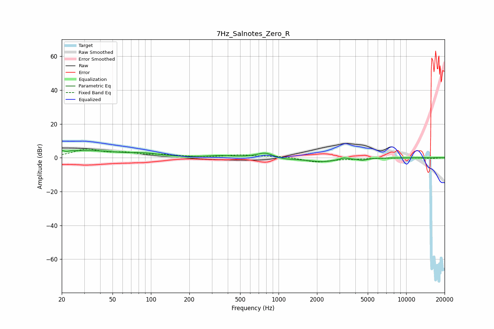

# 7Hz_Salnotes_Zero_R
See [usage instructions](https://github.com/jaakkopasanen/AutoEq#usage) for more options and info.

### Parametric EQs
Apply preamp of -4.3 dB when using parametric equalizer.

|   # | Type    |   Fc (Hz) |    Q |   Gain (dB) |
|-----|---------|-----------|------|-------------|
|   1 | Peaking |        21 | 3.16 |         4   |
|   2 | Peaking |        22 | 4.96 |        -2.9 |
|   3 | Peaking |        34 | 0.65 |         3.8 |
|   4 | Peaking |        90 | 1.24 |         1.6 |
|   5 | Peaking |       356 | 1.38 |         1   |
|   6 | Peaking |       787 | 2.18 |         3.1 |
|   7 | Peaking |      1096 | 1.75 |        -0.9 |
|   8 | Peaking |      2195 | 1.15 |        -2.3 |
|   9 | Peaking |      3243 | 4.57 |         1.1 |
|  10 | Peaking |      4543 | 4.09 |        -1.1 |

### Fixed Band EQs
When using fixed band (also called graphic) equalizer, apply preamp of **-5.2 dB** (if available) and set gains manually with these parameters.

|   # | Type    |   Fc (Hz) |    Q |   Gain (dB) |
|-----|---------|-----------|------|-------------|
|   1 | Peaking |        31 | 1.41 |         4.7 |
|   2 | Peaking |        62 | 1.41 |         2.3 |
|   3 | Peaking |       125 | 1.41 |         1.4 |
|   4 | Peaking |       250 | 1.41 |         0.2 |
|   5 | Peaking |       500 | 1.41 |         1.5 |
|   6 | Peaking |      1000 | 1.41 |         0.9 |
|   7 | Peaking |      2000 | 1.41 |        -2.6 |
|   8 | Peaking |      4000 | 1.41 |        -0.6 |
|   9 | Peaking |      8000 | 1.41 |        -0.1 |
|  10 | Peaking |     16000 | 1.41 |        -0.4 |

### Graphs

