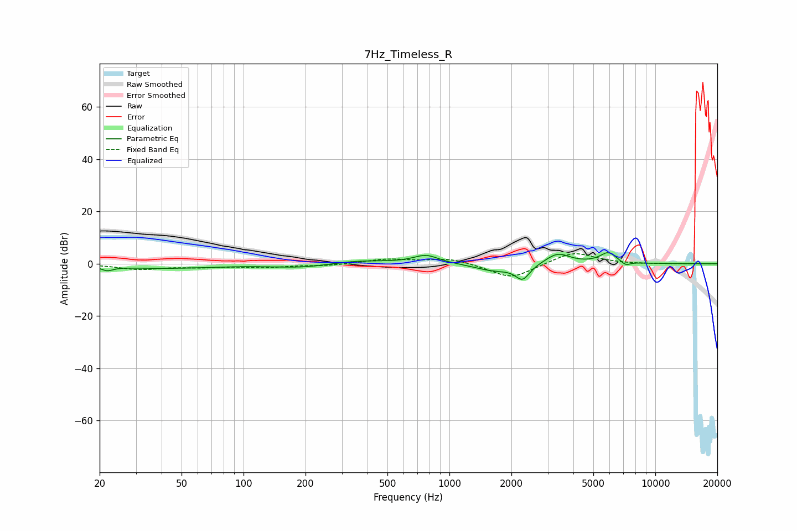

# 7Hz_Timeless_R
See [usage instructions](https://github.com/jaakkopasanen/AutoEq#usage) for more options and info.

### Parametric EQs
Apply preamp of -4.3 dB when using parametric equalizer.

|   # | Type    |   Fc (Hz) |    Q |   Gain (dB) |
|-----|---------|-----------|------|-------------|
|   1 | Peaking |        22 | 5.19 |        -1.6 |
|   2 | Peaking |        40 | 0.56 |        -1.7 |
|   3 | Peaking |       199 | 0.9  |        -1.7 |
|   4 | Peaking |       346 | 0.89 |         1.6 |
|   5 | Peaking |       771 | 2.29 |         3.2 |
|   6 | Peaking |      1641 | 1.56 |        -2.6 |
|   7 | Peaking |      2265 | 4.01 |        -5.7 |
|   8 | Peaking |      3357 | 2.4  |         4.2 |
|   9 | Peaking |      5909 | 3.36 |         4.1 |
|  10 | Peaking |      7173 | 5.86 |        -1.6 |

### Fixed Band EQs
When using fixed band (also called graphic) equalizer, apply preamp of **-3.9 dB** (if available) and set gains manually with these parameters.

|   # | Type    |   Fc (Hz) |    Q |   Gain (dB) |
|-----|---------|-----------|------|-------------|
|   1 | Peaking |        31 | 1.41 |        -2   |
|   2 | Peaking |        62 | 1.41 |        -1   |
|   3 | Peaking |       125 | 1.41 |        -1.2 |
|   4 | Peaking |       250 | 1.41 |        -0.7 |
|   5 | Peaking |       500 | 1.41 |         1.7 |
|   6 | Peaking |      1000 | 1.41 |         2.2 |
|   7 | Peaking |      2000 | 1.41 |        -5.9 |
|   8 | Peaking |      4000 | 1.41 |         4.8 |
|   9 | Peaking |      8000 | 1.41 |        -0.2 |
|  10 | Peaking |     16000 | 1.41 |         0   |

### Graphs

