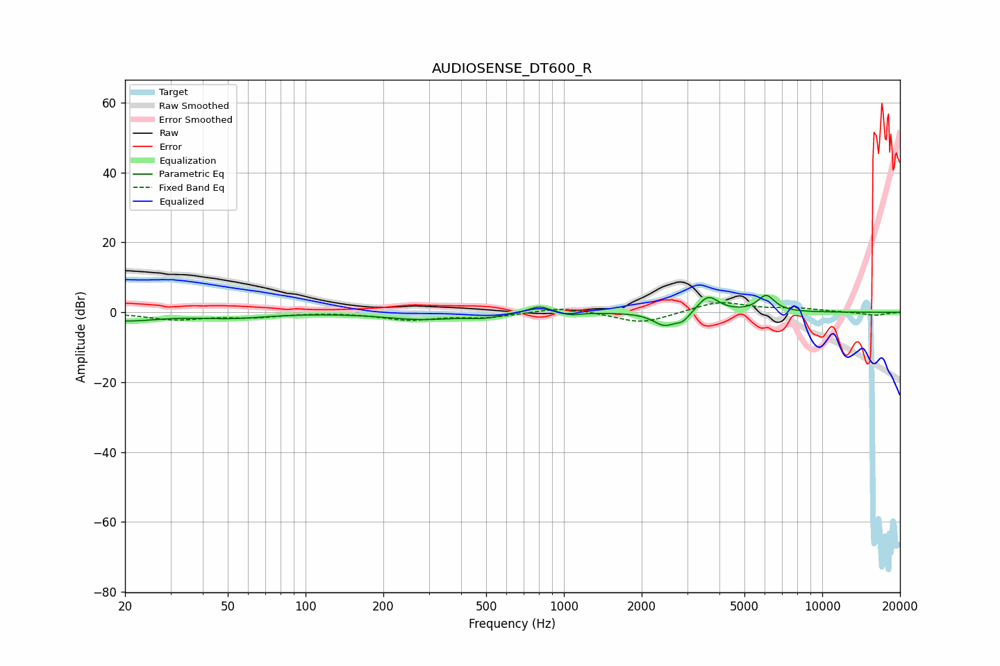

# AUDIOSENSE_DT600_R
See [usage instructions](https://github.com/jaakkopasanen/AutoEq#usage) for more options and info.

### Parametric EQs
Apply preamp of -4.9 dB when using parametric equalizer.

|   # | Type    |   Fc (Hz) |    Q |   Gain (dB) |
|-----|---------|-----------|------|-------------|
|   1 | Peaking |        20 | 1.08 |        -2.3 |
|   2 | Peaking |        52 | 1.06 |        -1.4 |
|   3 | Peaking |       280 | 1.01 |        -1.9 |
|   4 | Peaking |       488 | 2.23 |        -1   |
|   5 | Peaking |       803 | 3.42 |         2.1 |
|   6 | Peaking |      1064 | 3.87 |        -0.8 |
|   7 | Peaking |      2446 | 3.24 |        -3.7 |
|   8 | Peaking |      2888 | 4.8  |        -2.3 |
|   9 | Peaking |      3614 | 3.44 |         4.9 |
|  10 | Peaking |      6071 | 4.14 |         4.7 |

### Fixed Band EQs
When using fixed band (also called graphic) equalizer, apply preamp of **-2.8 dB** (if available) and set gains manually with these parameters.

|   # | Type    |   Fc (Hz) |    Q |   Gain (dB) |
|-----|---------|-----------|------|-------------|
|   1 | Peaking |        31 | 1.41 |        -2   |
|   2 | Peaking |        62 | 1.41 |        -1.2 |
|   3 | Peaking |       125 | 1.41 |         0.1 |
|   4 | Peaking |       250 | 1.41 |        -2   |
|   5 | Peaking |       500 | 1.41 |        -1.4 |
|   6 | Peaking |      1000 | 1.41 |         1.6 |
|   7 | Peaking |      2000 | 1.41 |        -3.3 |
|   8 | Peaking |      4000 | 1.41 |         3.1 |
|   9 | Peaking |      8000 | 1.41 |         1   |
|  10 | Peaking |     16000 | 1.41 |        -0.9 |

### Graphs

