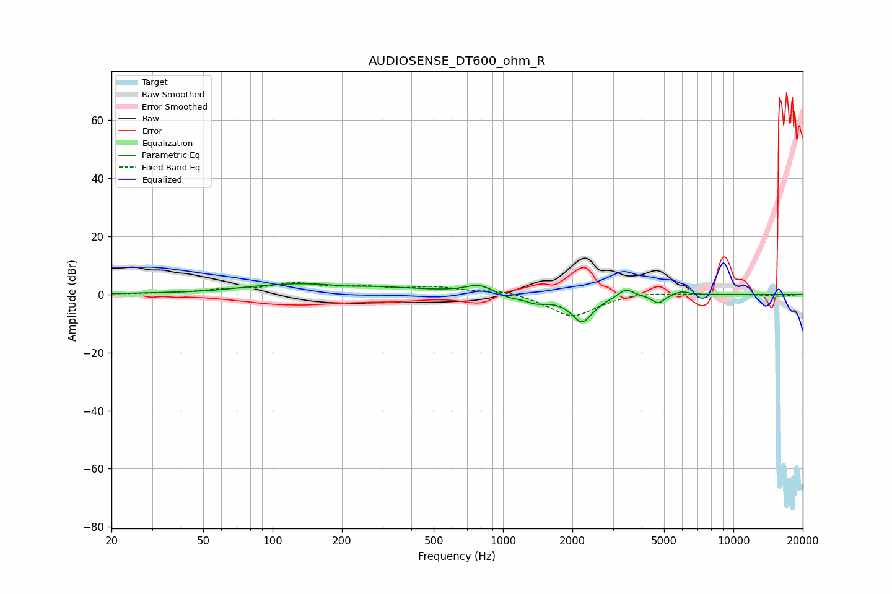

# AUDIOSENSE_DT600_ohm_R
See [usage instructions](https://github.com/jaakkopasanen/AutoEq#usage) for more options and info.

### Parametric EQs
Apply preamp of -3.8 dB when using parametric equalizer.

|   # | Type    |   Fc (Hz) |    Q |   Gain (dB) |
|-----|---------|-----------|------|-------------|
|   1 | Peaking |        55 | 0.92 |        -0.7 |
|   2 | Peaking |       149 | 0.4  |         4.1 |
|   3 | Peaking |       209 | 1.82 |        -0.9 |
|   4 | Peaking |       785 | 2.43 |         2.9 |
|   5 | Peaking |      1058 | 3.5  |        -1.1 |
|   6 | Peaking |      1391 | 2.56 |        -2.5 |
|   7 | Peaking |      2204 | 2.91 |        -9.4 |
|   8 | Peaking |      3412 | 4.51 |         2.9 |
|   9 | Peaking |      4715 | 5.21 |        -3   |
|  10 | Peaking |      5937 | 4.28 |         1.3 |

### Fixed Band EQs
When using fixed band (also called graphic) equalizer, apply preamp of **-4.2 dB** (if available) and set gains manually with these parameters.

|   # | Type    |   Fc (Hz) |    Q |   Gain (dB) |
|-----|---------|-----------|------|-------------|
|   1 | Peaking |        31 | 1.41 |         0.2 |
|   2 | Peaking |        62 | 1.41 |         1.3 |
|   3 | Peaking |       125 | 1.41 |         3.4 |
|   4 | Peaking |       250 | 1.41 |         1.9 |
|   5 | Peaking |       500 | 1.41 |         2.2 |
|   6 | Peaking |      1000 | 1.41 |         1.7 |
|   7 | Peaking |      2000 | 1.41 |        -7.9 |
|   8 | Peaking |      4000 | 1.41 |         1.1 |
|   9 | Peaking |      8000 | 1.41 |         0.1 |
|  10 | Peaking |     16000 | 1.41 |        -0.6 |

### Graphs

