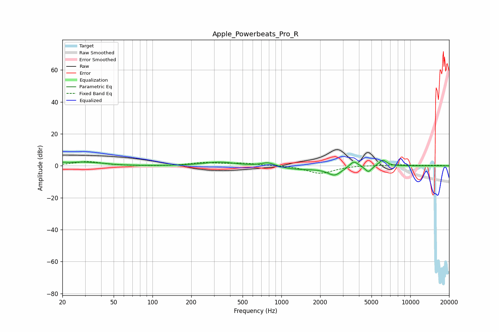

# Apple_Powerbeats_Pro_R
See [usage instructions](https://github.com/jaakkopasanen/AutoEq#usage) for more options and info.

### Parametric EQs
Apply preamp of -3.5 dB when using parametric equalizer.

|   # | Type    |   Fc (Hz) |    Q |   Gain (dB) |
|-----|---------|-----------|------|-------------|
|   1 | Peaking |        20 | 5.89 |         0.8 |
|   2 | Peaking |        27 | 1.33 |         1.9 |
|   3 | Peaking |        39 | 1.61 |         0.8 |
|   4 | Peaking |       331 | 1.16 |         2.4 |
|   5 | Peaking |       790 | 2.59 |         2.7 |
|   6 | Peaking |      1350 | 0.84 |        -2.2 |
|   7 | Peaking |      2589 | 2.56 |        -5.3 |
|   8 | Peaking |      3646 | 4.18 |         4.1 |
|   9 | Peaking |      4734 | 5.38 |        -4   |
|  10 | Peaking |      6117 | 4.4  |         4   |

### Fixed Band EQs
When using fixed band (also called graphic) equalizer, apply preamp of **-2.7 dB** (if available) and set gains manually with these parameters.

|   # | Type    |   Fc (Hz) |    Q |   Gain (dB) |
|-----|---------|-----------|------|-------------|
|   1 | Peaking |        31 | 1.41 |         2.6 |
|   2 | Peaking |        62 | 1.41 |        -0   |
|   3 | Peaking |       125 | 1.41 |        -0.2 |
|   4 | Peaking |       250 | 1.41 |         1.9 |
|   5 | Peaking |       500 | 1.41 |         1.5 |
|   6 | Peaking |      1000 | 1.41 |         0.4 |
|   7 | Peaking |      2000 | 1.41 |        -4.9 |
|   8 | Peaking |      4000 | 1.41 |         0.4 |
|   9 | Peaking |      8000 | 1.41 |         0.7 |
|  10 | Peaking |     16000 | 1.41 |         0.3 |

### Graphs

