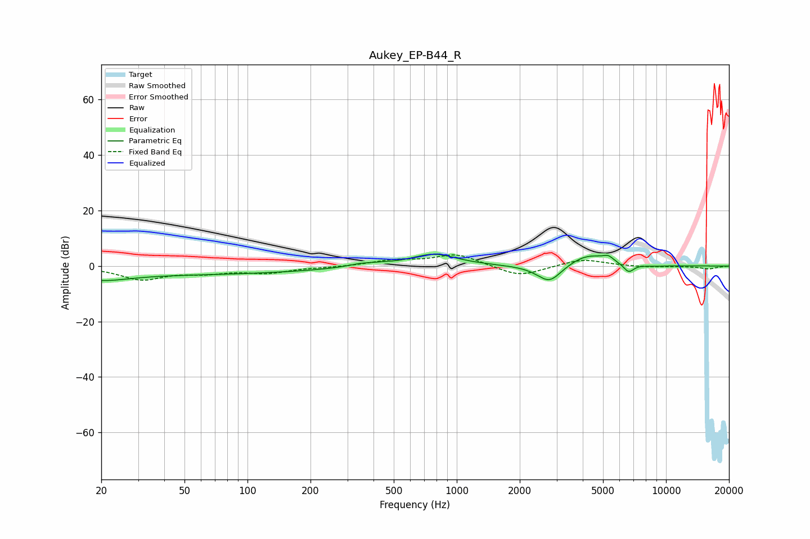

# Aukey_EP-B44_R
See [usage instructions](https://github.com/jaakkopasanen/AutoEq#usage) for more options and info.

### Parametric EQs
Apply preamp of -4.3 dB when using parametric equalizer.

|   # | Type    |   Fc (Hz) |    Q |   Gain (dB) |
|-----|---------|-----------|------|-------------|
|   1 | Peaking |        20 | 1.1  |        -2.5 |
|   2 | Peaking |        42 | 0.18 |        -3   |
|   3 | Peaking |       347 | 2.26 |         1   |
|   4 | Peaking |       440 | 2.79 |         0.5 |
|   5 | Peaking |       777 | 1.29 |         4.4 |
|   6 | Peaking |      2774 | 2.3  |        -6.9 |
|   7 | Peaking |      4226 | 1.39 |         4.6 |
|   8 | Peaking |      5290 | 5.77 |         1.6 |
|   9 | Peaking |      6630 | 5.39 |        -3.2 |
|  10 | Peaking |      8640 | 2.27 |        -0.4 |

### Fixed Band EQs
When using fixed band (also called graphic) equalizer, apply preamp of **-4.1 dB** (if available) and set gains manually with these parameters.

|   # | Type    |   Fc (Hz) |    Q |   Gain (dB) |
|-----|---------|-----------|------|-------------|
|   1 | Peaking |        31 | 1.41 |        -4.6 |
|   2 | Peaking |        62 | 1.41 |        -2   |
|   3 | Peaking |       125 | 1.41 |        -2.2 |
|   4 | Peaking |       250 | 1.41 |        -0.3 |
|   5 | Peaking |       500 | 1.41 |         1.9 |
|   6 | Peaking |      1000 | 1.41 |         4.3 |
|   7 | Peaking |      2000 | 1.41 |        -4   |
|   8 | Peaking |      4000 | 1.41 |         2.6 |
|   9 | Peaking |      8000 | 1.41 |        -0.4 |
|  10 | Peaking |     16000 | 1.41 |        -1   |

### Graphs

