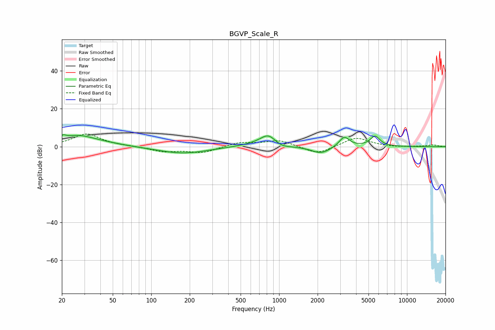

# BGVP_Scale_R
See [usage instructions](https://github.com/jaakkopasanen/AutoEq#usage) for more options and info.

### Parametric EQs
Apply preamp of -6.4 dB when using parametric equalizer.

|   # | Type    |   Fc (Hz) |    Q |   Gain (dB) |
|-----|---------|-----------|------|-------------|
|   1 | Peaking |        20 | 5.99 |         2   |
|   2 | Peaking |        26 | 1.14 |         5   |
|   3 | Peaking |        40 | 0.88 |         1.5 |
|   4 | Peaking |       177 | 0.73 |        -3.6 |
|   5 | Peaking |       655 | 1.02 |         1.1 |
|   6 | Peaking |       826 | 2.16 |         6.3 |
|   7 | Peaking |      1029 | 2.14 |        -2.1 |
|   8 | Peaking |      2128 | 1.86 |        -3.8 |
|   9 | Peaking |      3231 | 3.45 |         5.6 |
|  10 | Peaking |      5626 | 3.58 |         5.4 |

### Fixed Band EQs
When using fixed band (also called graphic) equalizer, apply preamp of **-6.8 dB** (if available) and set gains manually with these parameters.

|   # | Type    |   Fc (Hz) |    Q |   Gain (dB) |
|-----|---------|-----------|------|-------------|
|   1 | Peaking |        31 | 1.41 |         6.8 |
|   2 | Peaking |        62 | 1.41 |         0.2 |
|   3 | Peaking |       125 | 1.41 |        -2.5 |
|   4 | Peaking |       250 | 1.41 |        -3.1 |
|   5 | Peaking |       500 | 1.41 |         2.2 |
|   6 | Peaking |      1000 | 1.41 |         3.4 |
|   7 | Peaking |      2000 | 1.41 |        -4.2 |
|   8 | Peaking |      4000 | 1.41 |         5   |
|   9 | Peaking |      8000 | 1.41 |        -0.3 |
|  10 | Peaking |     16000 | 1.41 |         0.9 |

### Graphs

