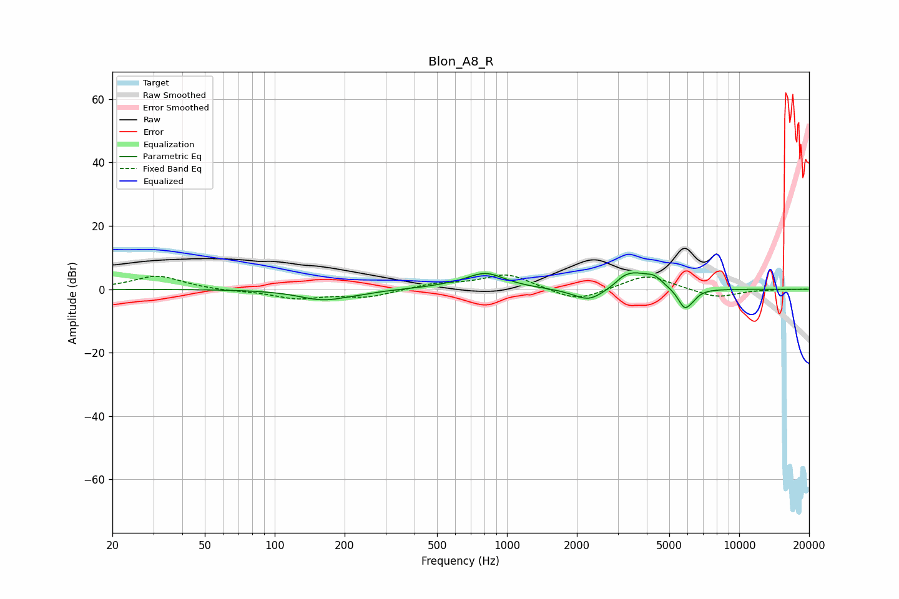

# Blon_A8_R
See [usage instructions](https://github.com/jaakkopasanen/AutoEq#usage) for more options and info.

### Parametric EQs
Apply preamp of -5.3 dB when using parametric equalizer.

|   # | Type    |   Fc (Hz) |    Q |   Gain (dB) |
|-----|---------|-----------|------|-------------|
|   1 | Peaking |       162 | 1.37 |        -3.3 |
|   2 | Peaking |       235 | 2.17 |        -0.5 |
|   3 | Peaking |       536 | 1.62 |         0.4 |
|   4 | Peaking |       808 | 1.66 |         5   |
|   5 | Peaking |      2255 | 2.09 |        -4.2 |
|   6 | Peaking |      3140 | 5.62 |         0.8 |
|   7 | Peaking |      3473 | 2.24 |         5   |
|   8 | Peaking |      4296 | 3.58 |         2.9 |
|   9 | Peaking |      5823 | 4.63 |        -6.2 |
|  10 | Peaking |      6327 | 6    |        -1.2 |

### Fixed Band EQs
When using fixed band (also called graphic) equalizer, apply preamp of **-4.6 dB** (if available) and set gains manually with these parameters.

|   # | Type    |   Fc (Hz) |    Q |   Gain (dB) |
|-----|---------|-----------|------|-------------|
|   1 | Peaking |        31 | 1.41 |         4.3 |
|   2 | Peaking |        62 | 1.41 |        -0.5 |
|   3 | Peaking |       125 | 1.41 |        -2.8 |
|   4 | Peaking |       250 | 1.41 |        -2.4 |
|   5 | Peaking |       500 | 1.41 |         1.7 |
|   6 | Peaking |      1000 | 1.41 |         4.9 |
|   7 | Peaking |      2000 | 1.41 |        -4.1 |
|   8 | Peaking |      4000 | 1.41 |         4.8 |
|   9 | Peaking |      8000 | 1.41 |        -2.8 |
|  10 | Peaking |     16000 | 1.41 |         0   |

### Graphs

