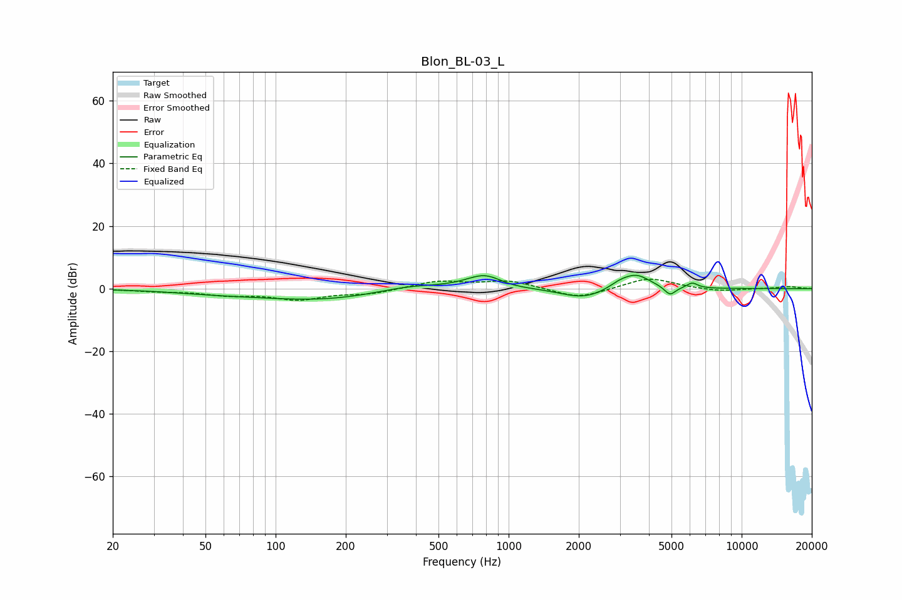

# Blon_BL-03_L
See [usage instructions](https://github.com/jaakkopasanen/AutoEq#usage) for more options and info.

### Parametric EQs
Apply preamp of -4.3 dB when using parametric equalizer.

|   # | Type    |   Fc (Hz) |    Q |   Gain (dB) |
|-----|---------|-----------|------|-------------|
|   1 | Peaking |        54 | 0.74 |        -0.9 |
|   2 | Peaking |       155 | 0.52 |        -3.5 |
|   3 | Peaking |       373 | 1.01 |         1.8 |
|   4 | Peaking |       794 | 1.71 |         4.8 |
|   5 | Peaking |       979 | 1.77 |        -0.8 |
|   6 | Peaking |      2096 | 1.43 |        -3.3 |
|   7 | Peaking |      3004 | 3.07 |         1.6 |
|   8 | Peaking |      3540 | 2.33 |         4.4 |
|   9 | Peaking |      4925 | 5.89 |        -2.9 |
|  10 | Peaking |      6140 | 5.99 |         1.7 |

### Fixed Band EQs
When using fixed band (also called graphic) equalizer, apply preamp of **-3.1 dB** (if available) and set gains manually with these parameters.

|   # | Type    |   Fc (Hz) |    Q |   Gain (dB) |
|-----|---------|-----------|------|-------------|
|   1 | Peaking |        31 | 1.41 |        -0.7 |
|   2 | Peaking |        62 | 1.41 |        -1.8 |
|   3 | Peaking |       125 | 1.41 |        -3.2 |
|   4 | Peaking |       250 | 1.41 |        -1.5 |
|   5 | Peaking |       500 | 1.41 |         2.4 |
|   6 | Peaking |      1000 | 1.41 |         2.5 |
|   7 | Peaking |      2000 | 1.41 |        -3.3 |
|   8 | Peaking |      4000 | 1.41 |         3.6 |
|   9 | Peaking |      8000 | 1.41 |        -1   |
|  10 | Peaking |     16000 | 1.41 |         0.7 |

### Graphs

