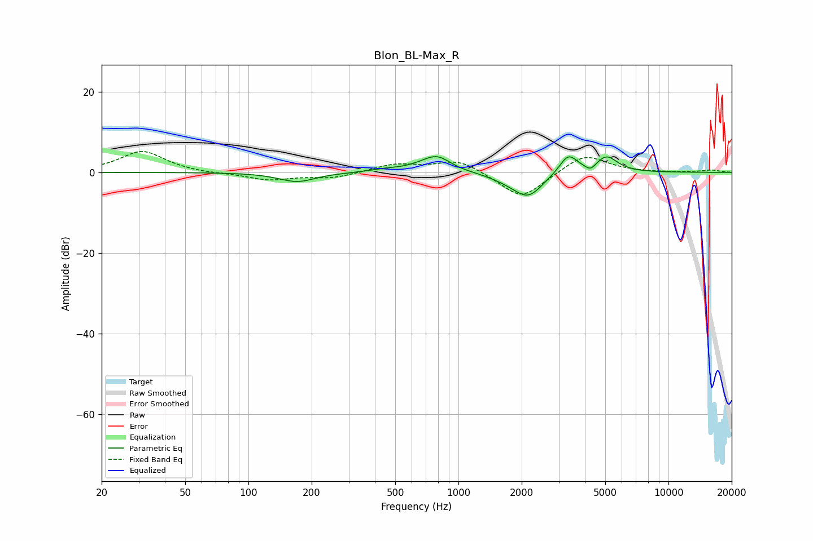

# Blon_BL-Max_R
See [usage instructions](https://github.com/jaakkopasanen/AutoEq#usage) for more options and info.

### Parametric EQs
Apply preamp of -4.0 dB when using parametric equalizer.

|   # | Type    |   Fc (Hz) |    Q |   Gain (dB) |
|-----|---------|-----------|------|-------------|
|   1 | Peaking |       170 | 1.63 |        -2.3 |
|   2 | Peaking |       439 | 2.42 |         0.4 |
|   3 | Peaking |       689 | 1.23 |         0.7 |
|   4 | Peaking |       798 | 1.93 |         4   |
|   5 | Peaking |       922 | 2.02 |        -0.6 |
|   6 | Peaking |      1760 | 1.46 |        -1.2 |
|   7 | Peaking |      2152 | 2.01 |        -5.5 |
|   8 | Peaking |      3334 | 3.24 |         4.8 |
|   9 | Peaking |      4256 | 5.89 |        -1.5 |
|  10 | Peaking |      5076 | 2.69 |         4   |

### Fixed Band EQs
When using fixed band (also called graphic) equalizer, apply preamp of **-5.3 dB** (if available) and set gains manually with these parameters.

|   # | Type    |   Fc (Hz) |    Q |   Gain (dB) |
|-----|---------|-----------|------|-------------|
|   1 | Peaking |        31 | 1.41 |         5.3 |
|   2 | Peaking |        62 | 1.41 |        -0.3 |
|   3 | Peaking |       125 | 1.41 |        -1.8 |
|   4 | Peaking |       250 | 1.41 |        -1.4 |
|   5 | Peaking |       500 | 1.41 |         2   |
|   6 | Peaking |      1000 | 1.41 |         3.2 |
|   7 | Peaking |      2000 | 1.41 |        -6.8 |
|   8 | Peaking |      4000 | 1.41 |         4.7 |
|   9 | Peaking |      8000 | 1.41 |        -0   |
|  10 | Peaking |     16000 | 1.41 |         0.6 |

### Graphs

