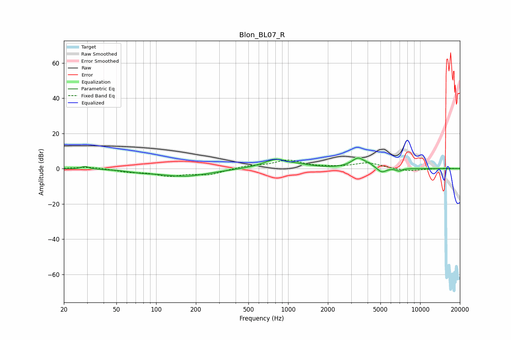

# Blon_BL07_R
See [usage instructions](https://github.com/jaakkopasanen/AutoEq#usage) for more options and info.

### Parametric EQs
Apply preamp of -6.1 dB when using parametric equalizer.

|   # | Type    |   Fc (Hz) |    Q |   Gain (dB) |
|-----|---------|-----------|------|-------------|
|   1 | Peaking |        29 | 5.58 |         1.6 |
|   2 | Peaking |        76 | 1.6  |        -1   |
|   3 | Peaking |       163 | 0.75 |        -4.3 |
|   4 | Peaking |       828 | 1.41 |         5.7 |
|   5 | Peaking |       975 | 2.24 |        -0.8 |
|   6 | Peaking |      1224 | 1.65 |         0.9 |
|   7 | Peaking |      3396 | 2.77 |         5.8 |
|   8 | Peaking |      4120 | 5.16 |         1.1 |
|   9 | Peaking |      5121 | 4.27 |        -2.8 |
|  10 | Peaking |      6945 | 6    |        -1.4 |

### Fixed Band EQs
When using fixed band (also called graphic) equalizer, apply preamp of **-5.0 dB** (if available) and set gains manually with these parameters.

|   # | Type    |   Fc (Hz) |    Q |   Gain (dB) |
|-----|---------|-----------|------|-------------|
|   1 | Peaking |        31 | 1.41 |         1.1 |
|   2 | Peaking |        62 | 1.41 |        -1.6 |
|   3 | Peaking |       125 | 1.41 |        -3.7 |
|   4 | Peaking |       250 | 1.41 |        -3.1 |
|   5 | Peaking |       500 | 1.41 |         1.4 |
|   6 | Peaking |      1000 | 1.41 |         4.6 |
|   7 | Peaking |      2000 | 1.41 |         0.4 |
|   8 | Peaking |      4000 | 1.41 |         3.2 |
|   9 | Peaking |      8000 | 1.41 |        -1.6 |
|  10 | Peaking |     16000 | 1.41 |         0.3 |

### Graphs

