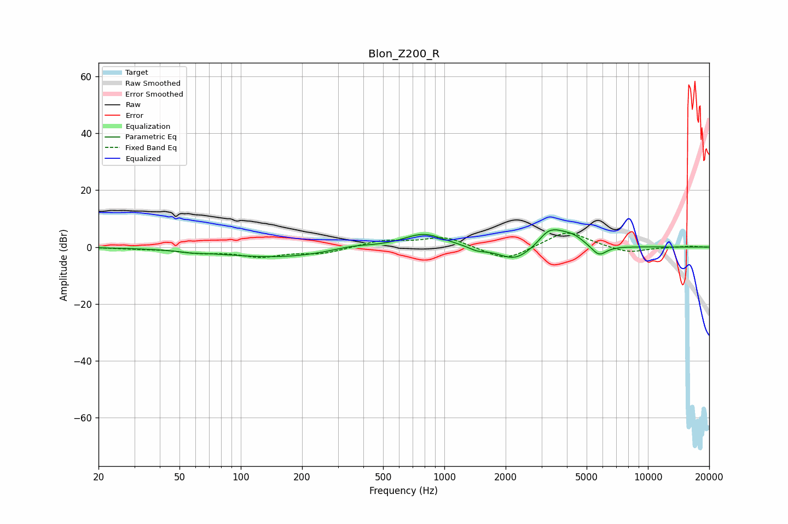

# Blon_Z200_R
See [usage instructions](https://github.com/jaakkopasanen/AutoEq#usage) for more options and info.

### Parametric EQs
Apply preamp of -6.2 dB when using parametric equalizer.

|   # | Type    |   Fc (Hz) |    Q |   Gain (dB) |
|-----|---------|-----------|------|-------------|
|   1 | Peaking |        57 | 2.65 |        -0.5 |
|   2 | Peaking |       151 | 0.48 |        -3.6 |
|   3 | Peaking |       353 | 1.38 |         1.5 |
|   4 | Peaking |       791 | 1.36 |         5   |
|   5 | Peaking |      1447 | 3.55 |        -1.2 |
|   6 | Peaking |      2233 | 1.65 |        -5.4 |
|   7 | Peaking |      3156 | 4.45 |         1.1 |
|   8 | Peaking |      3412 | 2.03 |         6   |
|   9 | Peaking |      4293 | 2.46 |         2.7 |
|  10 | Peaking |      5747 | 3.68 |        -3.8 |

### Fixed Band EQs
When using fixed band (also called graphic) equalizer, apply preamp of **-5.0 dB** (if available) and set gains manually with these parameters.

|   # | Type    |   Fc (Hz) |    Q |   Gain (dB) |
|-----|---------|-----------|------|-------------|
|   1 | Peaking |        31 | 1.41 |        -0.4 |
|   2 | Peaking |        62 | 1.41 |        -1.6 |
|   3 | Peaking |       125 | 1.41 |        -3   |
|   4 | Peaking |       250 | 1.41 |        -2.1 |
|   5 | Peaking |       500 | 1.41 |         2.3 |
|   6 | Peaking |      1000 | 1.41 |         3.6 |
|   7 | Peaking |      2000 | 1.41 |        -5.1 |
|   8 | Peaking |      4000 | 1.41 |         6   |
|   9 | Peaking |      8000 | 1.41 |        -2.2 |
|  10 | Peaking |     16000 | 1.41 |         0.3 |

### Graphs

