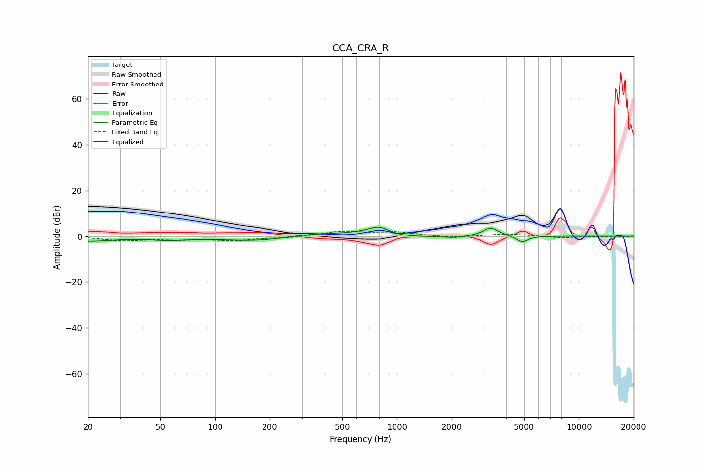

# CCA_CRA_R
See [usage instructions](https://github.com/jaakkopasanen/AutoEq#usage) for more options and info.

### Parametric EQs
Apply preamp of -4.1 dB when using parametric equalizer.

|   # | Type    |   Fc (Hz) |    Q |   Gain (dB) |
|-----|---------|-----------|------|-------------|
|   1 | Peaking |        20 | 1.04 |        -2   |
|   2 | Peaking |        55 | 1.31 |        -1.2 |
|   3 | Peaking |       172 | 0.72 |        -2.2 |
|   4 | Peaking |       349 | 0.85 |         1.6 |
|   5 | Peaking |       613 | 1.65 |         0.7 |
|   6 | Peaking |       800 | 2.33 |         4.1 |
|   7 | Peaking |       974 | 1.13 |        -1   |
|   8 | Peaking |      2078 | 2.25 |        -0.8 |
|   9 | Peaking |      3277 | 3.28 |         3.9 |
|  10 | Peaking |      4874 | 4.34 |        -2.7 |

### Fixed Band EQs
When using fixed band (also called graphic) equalizer, apply preamp of **-2.4 dB** (if available) and set gains manually with these parameters.

|   # | Type    |   Fc (Hz) |    Q |   Gain (dB) |
|-----|---------|-----------|------|-------------|
|   1 | Peaking |        31 | 1.41 |        -1.8 |
|   2 | Peaking |        62 | 1.41 |        -1.1 |
|   3 | Peaking |       125 | 1.41 |        -1.7 |
|   4 | Peaking |       250 | 1.41 |        -0.7 |
|   5 | Peaking |       500 | 1.41 |         2.1 |
|   6 | Peaking |      1000 | 1.41 |         1.8 |
|   7 | Peaking |      2000 | 1.41 |        -0.8 |
|   8 | Peaking |      4000 | 1.41 |         1.1 |
|   9 | Peaking |      8000 | 1.41 |        -0.7 |
|  10 | Peaking |     16000 | 1.41 |        -0.4 |

### Graphs

