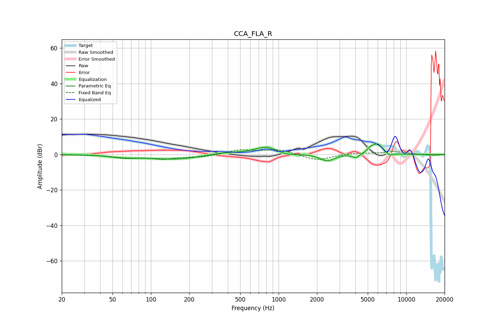

# CCA_FLA_R
See [usage instructions](https://github.com/jaakkopasanen/AutoEq#usage) for more options and info.

### Parametric EQs
Apply preamp of -6.1 dB when using parametric equalizer.

|   # | Type    |   Fc (Hz) |    Q |   Gain (dB) |
|-----|---------|-----------|------|-------------|
|   1 | Peaking |        62 | 1.55 |        -1.1 |
|   2 | Peaking |       153 | 0.67 |        -2.7 |
|   3 | Peaking |       373 | 1.24 |         1.3 |
|   4 | Peaking |       803 | 1.55 |         4.5 |
|   5 | Peaking |      1131 | 2.08 |        -1.3 |
|   6 | Peaking |      2409 | 2.62 |        -3.8 |
|   7 | Peaking |      4053 | 5.49 |        -2.2 |
|   8 | Peaking |      5221 | 5.98 |         1.9 |
|   9 | Peaking |      5955 | 3.23 |         5.9 |
|  10 | Peaking |      7416 | 5.34 |        -1.7 |

### Fixed Band EQs
When using fixed band (also called graphic) equalizer, apply preamp of **-2.8 dB** (if available) and set gains manually with these parameters.

|   # | Type    |   Fc (Hz) |    Q |   Gain (dB) |
|-----|---------|-----------|------|-------------|
|   1 | Peaking |        31 | 1.41 |         0.1 |
|   2 | Peaking |        62 | 1.41 |        -1.8 |
|   3 | Peaking |       125 | 1.41 |        -2.2 |
|   4 | Peaking |       250 | 1.41 |        -1.3 |
|   5 | Peaking |       500 | 1.41 |         2.5 |
|   6 | Peaking |      1000 | 1.41 |         2.8 |
|   7 | Peaking |      2000 | 1.41 |        -3.5 |
|   8 | Peaking |      4000 | 1.41 |         0.8 |
|   9 | Peaking |      8000 | 1.41 |         1.6 |
|  10 | Peaking |     16000 | 1.41 |        -0.7 |

### Graphs

