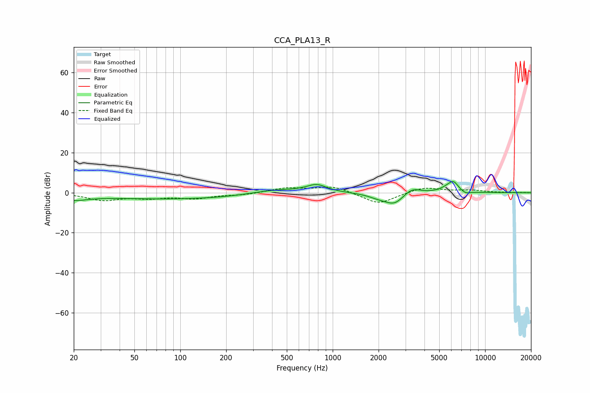

# CCA_PLA13_R
See [usage instructions](https://github.com/jaakkopasanen/AutoEq#usage) for more options and info.

### Parametric EQs
Apply preamp of -5.7 dB when using parametric equalizer.

|   # | Type    |   Fc (Hz) |    Q |   Gain (dB) |
|-----|---------|-----------|------|-------------|
|   1 | Peaking |        20 | 1.55 |        -2.6 |
|   2 | Peaking |       113 | 0.22 |        -3.3 |
|   3 | Peaking |       414 | 0.74 |         3   |
|   4 | Peaking |       785 | 2.13 |         3.8 |
|   5 | Peaking |      2006 | 2.1  |        -1.6 |
|   6 | Peaking |      2551 | 2.13 |        -5.7 |
|   7 | Peaking |      3292 | 2.49 |         3.6 |
|   8 | Peaking |      5752 | 2.83 |         2.5 |
|   9 | Peaking |      6227 | 4.57 |         3.8 |
|  10 | Peaking |      7453 | 4.69 |        -1.3 |

### Fixed Band EQs
When using fixed band (also called graphic) equalizer, apply preamp of **-2.9 dB** (if available) and set gains manually with these parameters.

|   # | Type    |   Fc (Hz) |    Q |   Gain (dB) |
|-----|---------|-----------|------|-------------|
|   1 | Peaking |        31 | 1.41 |        -3.5 |
|   2 | Peaking |        62 | 1.41 |        -2.2 |
|   3 | Peaking |       125 | 1.41 |        -2.6 |
|   4 | Peaking |       250 | 1.41 |        -1   |
|   5 | Peaking |       500 | 1.41 |         2.3 |
|   6 | Peaking |      1000 | 1.41 |         3.3 |
|   7 | Peaking |      2000 | 1.41 |        -5.9 |
|   8 | Peaking |      4000 | 1.41 |         2.9 |
|   9 | Peaking |      8000 | 1.41 |         1.1 |
|  10 | Peaking |     16000 | 1.41 |         0   |

### Graphs

