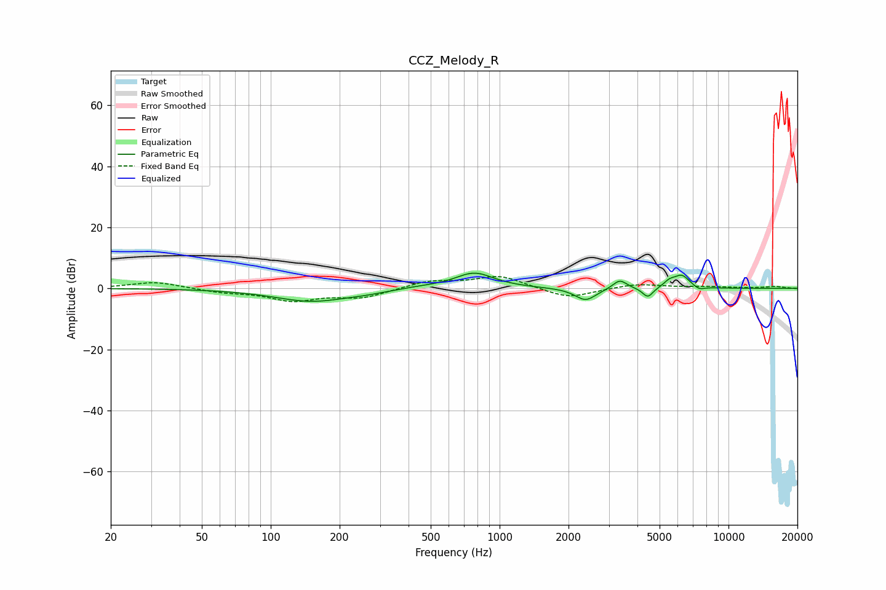

# CCZ_Melody_R
See [usage instructions](https://github.com/jaakkopasanen/AutoEq#usage) for more options and info.

### Parametric EQs
Apply preamp of -5.1 dB when using parametric equalizer.

|   # | Type    |   Fc (Hz) |    Q |   Gain (dB) |
|-----|---------|-----------|------|-------------|
|   1 | Peaking |       151 | 0.87 |        -4.2 |
|   2 | Peaking |       262 | 1.61 |        -0.6 |
|   3 | Peaking |       445 | 1.52 |         0.5 |
|   4 | Peaking |       775 | 1.65 |         5.2 |
|   5 | Peaking |      2376 | 3.05 |        -4.1 |
|   6 | Peaking |      3349 | 4.62 |         3.1 |
|   7 | Peaking |      4442 | 6    |        -3.3 |
|   8 | Peaking |      5518 | 5.84 |         1.7 |
|   9 | Peaking |      6244 | 3.9  |         4.2 |
|  10 | Peaking |      7447 | 5.56 |        -1.2 |

### Fixed Band EQs
When using fixed band (also called graphic) equalizer, apply preamp of **-4.0 dB** (if available) and set gains manually with these parameters.

|   # | Type    |   Fc (Hz) |    Q |   Gain (dB) |
|-----|---------|-----------|------|-------------|
|   1 | Peaking |        31 | 1.41 |         2.2 |
|   2 | Peaking |        62 | 1.41 |        -1.1 |
|   3 | Peaking |       125 | 1.41 |        -3.8 |
|   4 | Peaking |       250 | 1.41 |        -2.9 |
|   5 | Peaking |       500 | 1.41 |         2.4 |
|   6 | Peaking |      1000 | 1.41 |         4.1 |
|   7 | Peaking |      2000 | 1.41 |        -3.4 |
|   8 | Peaking |      4000 | 1.41 |         1.5 |
|   9 | Peaking |      8000 | 1.41 |         0.5 |
|  10 | Peaking |     16000 | 1.41 |         0.6 |

### Graphs

