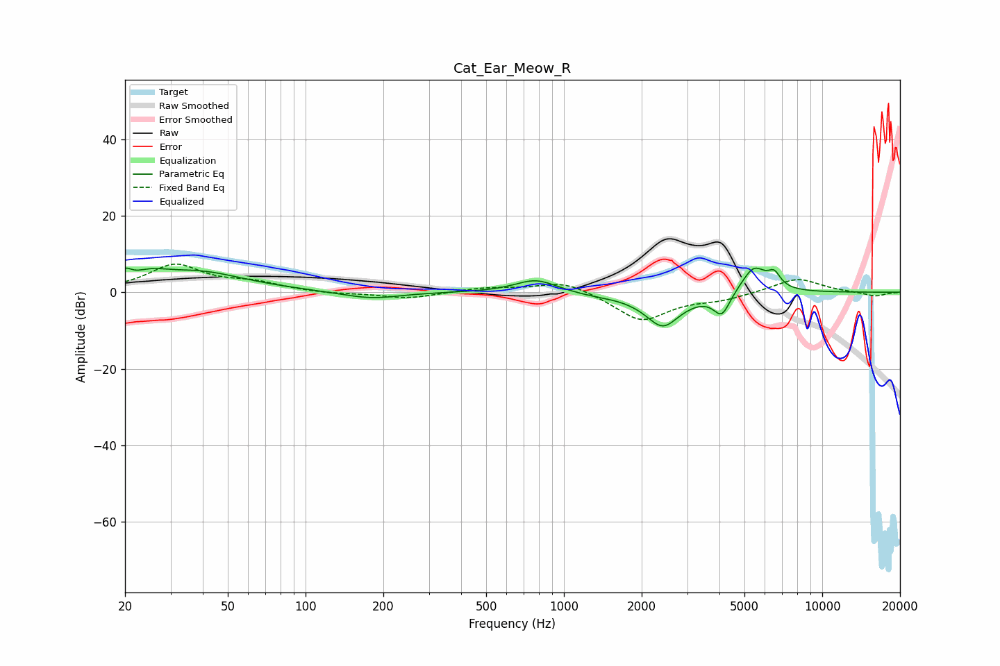

# Cat_Ear_Meow_R
See [usage instructions](https://github.com/jaakkopasanen/AutoEq#usage) for more options and info.

### Parametric EQs
Apply preamp of -6.4 dB when using parametric equalizer.

|   # | Type    |   Fc (Hz) |    Q |   Gain (dB) |
|-----|---------|-----------|------|-------------|
|   1 | Peaking |        20 | 5.98 |         2.6 |
|   2 | Peaking |        25 | 2.13 |         2.3 |
|   3 | Peaking |        38 | 0.77 |         5.2 |
|   4 | Peaking |       179 | 1.27 |        -1.9 |
|   5 | Peaking |       779 | 1.74 |         3.5 |
|   6 | Peaking |      1326 | 1.43 |        -0.6 |
|   7 | Peaking |      2415 | 2    |        -8.8 |
|   8 | Peaking |      4087 | 4.28 |        -6   |
|   9 | Peaking |      5437 | 2.74 |         7.1 |
|  10 | Peaking |      6521 | 5.73 |         3.4 |

### Fixed Band EQs
When using fixed band (also called graphic) equalizer, apply preamp of **-7.5 dB** (if available) and set gains manually with these parameters.

|   # | Type    |   Fc (Hz) |    Q |   Gain (dB) |
|-----|---------|-----------|------|-------------|
|   1 | Peaking |        31 | 1.41 |         7   |
|   2 | Peaking |        62 | 1.41 |         2.1 |
|   3 | Peaking |       125 | 1.41 |        -0.5 |
|   4 | Peaking |       250 | 1.41 |        -1.7 |
|   5 | Peaking |       500 | 1.41 |         1.1 |
|   6 | Peaking |      1000 | 1.41 |         3.2 |
|   7 | Peaking |      2000 | 1.41 |        -7.5 |
|   8 | Peaking |      4000 | 1.41 |        -1.6 |
|   9 | Peaking |      8000 | 1.41 |         3.8 |
|  10 | Peaking |     16000 | 1.41 |        -1.1 |

### Graphs

