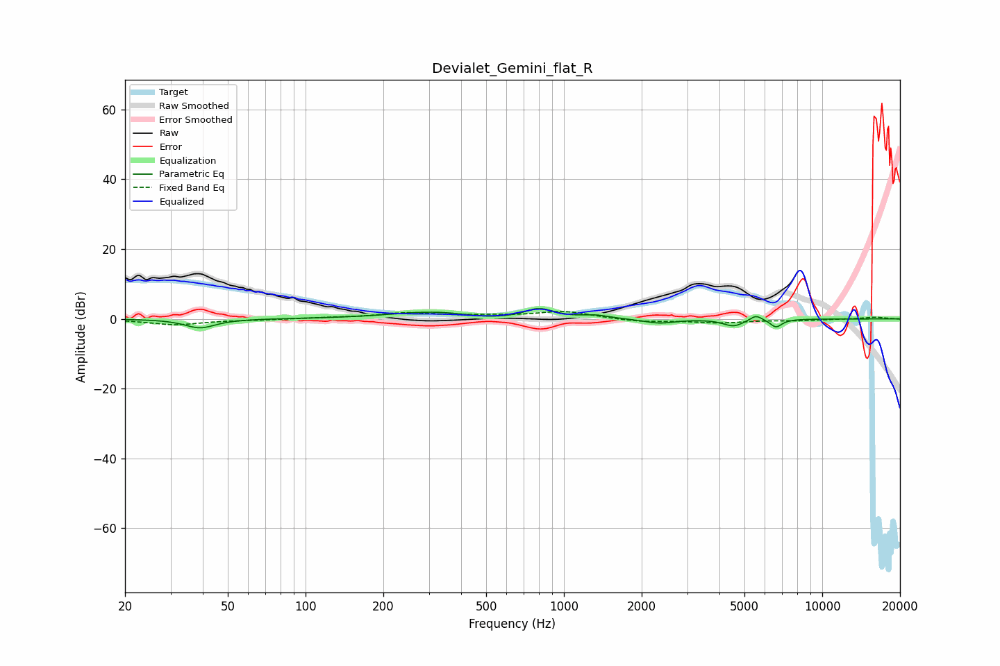

# Devialet_Gemini_flat_R
See [usage instructions](https://github.com/jaakkopasanen/AutoEq#usage) for more options and info.

### Parametric EQs
Apply preamp of -3.1 dB when using parametric equalizer.

|   # | Type    |   Fc (Hz) |    Q |   Gain (dB) |
|-----|---------|-----------|------|-------------|
|   1 | Peaking |        39 | 2.44 |        -2.6 |
|   2 | Peaking |       316 | 0.81 |         1.9 |
|   3 | Peaking |       327 | 1.18 |         0.3 |
|   4 | Peaking |       507 | 1.19 |        -0.9 |
|   5 | Peaking |       801 | 2.56 |         2.8 |
|   6 | Peaking |      1320 | 2.79 |         0.9 |
|   7 | Peaking |      2339 | 2.36 |        -1.3 |
|   8 | Peaking |      4535 | 3.59 |        -2   |
|   9 | Peaking |      5543 | 5.97 |         1.6 |
|  10 | Peaking |      6626 | 6    |        -2.3 |

### Fixed Band EQs
When using fixed band (also called graphic) equalizer, apply preamp of **-2.2 dB** (if available) and set gains manually with these parameters.

|   # | Type    |   Fc (Hz) |    Q |   Gain (dB) |
|-----|---------|-----------|------|-------------|
|   1 | Peaking |        31 | 1.41 |        -1.6 |
|   2 | Peaking |        62 | 1.41 |        -0.2 |
|   3 | Peaking |       125 | 1.41 |         0.3 |
|   4 | Peaking |       250 | 1.41 |         1.6 |
|   5 | Peaking |       500 | 1.41 |         0.7 |
|   6 | Peaking |      1000 | 1.41 |         2.1 |
|   7 | Peaking |      2000 | 1.41 |        -0.9 |
|   8 | Peaking |      4000 | 1.41 |        -1   |
|   9 | Peaking |      8000 | 1.41 |        -0.4 |
|  10 | Peaking |     16000 | 1.41 |         0.5 |

### Graphs

