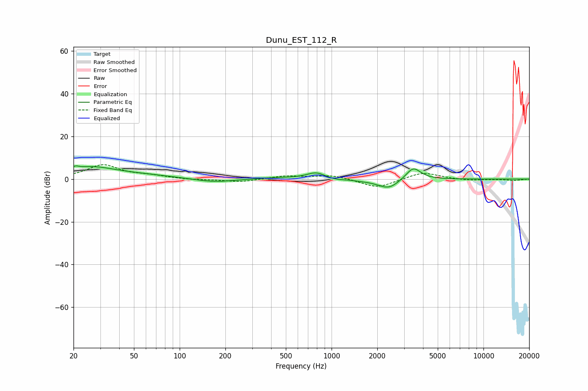

# Dunu_EST_112_R
See [usage instructions](https://github.com/jaakkopasanen/AutoEq#usage) for more options and info.

### Parametric EQs
Apply preamp of -6.3 dB when using parametric equalizer.

|   # | Type    |   Fc (Hz) |    Q |   Gain (dB) |
|-----|---------|-----------|------|-------------|
|   1 | Peaking |        21 | 6    |         1.5 |
|   2 | Peaking |        26 | 0.9  |         4.7 |
|   3 | Peaking |        52 | 0.52 |         1.6 |
|   4 | Peaking |       166 | 1.03 |        -1.8 |
|   5 | Peaking |       434 | 0.99 |         0.7 |
|   6 | Peaking |       794 | 2.14 |         3.6 |
|   7 | Peaking |      1143 | 1.05 |        -1.5 |
|   8 | Peaking |      1290 | 2.56 |         0.6 |
|   9 | Peaking |      2377 | 2.01 |        -4.5 |
|  10 | Peaking |      3448 | 2.82 |         6.1 |

### Fixed Band EQs
When using fixed band (also called graphic) equalizer, apply preamp of **-6.8 dB** (if available) and set gains manually with these parameters.

|   # | Type    |   Fc (Hz) |    Q |   Gain (dB) |
|-----|---------|-----------|------|-------------|
|   1 | Peaking |        31 | 1.41 |         6.5 |
|   2 | Peaking |        62 | 1.41 |         1.3 |
|   3 | Peaking |       125 | 1.41 |        -0.4 |
|   4 | Peaking |       250 | 1.41 |        -1.4 |
|   5 | Peaking |       500 | 1.41 |         1.5 |
|   6 | Peaking |      1000 | 1.41 |         1.9 |
|   7 | Peaking |      2000 | 1.41 |        -4.3 |
|   8 | Peaking |      4000 | 1.41 |         3.4 |
|   9 | Peaking |      8000 | 1.41 |        -0.7 |
|  10 | Peaking |     16000 | 1.41 |        -0.6 |

### Graphs

