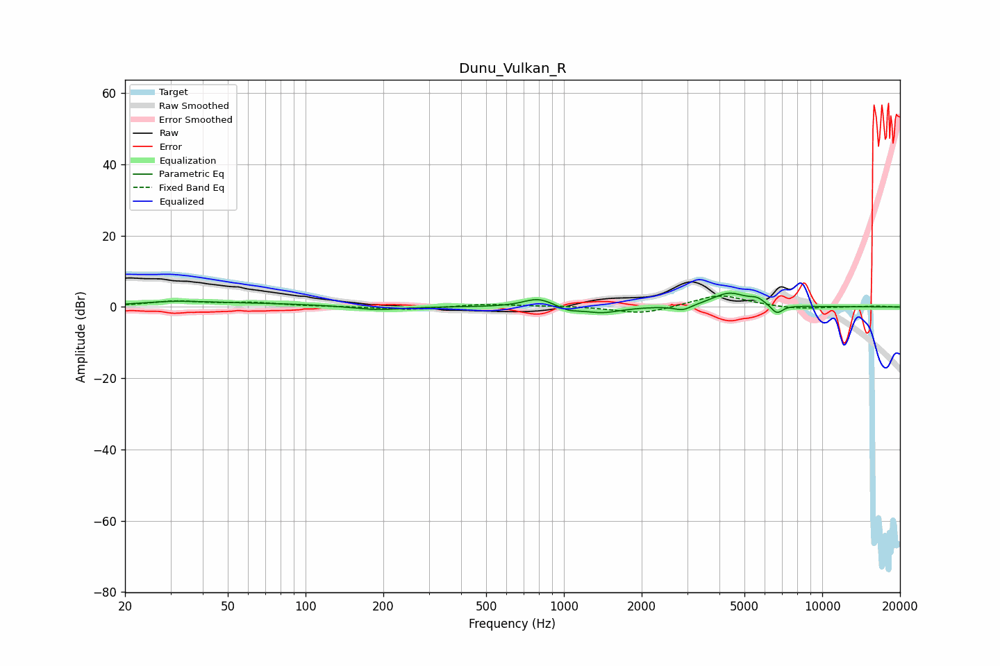

# Dunu_Vulkan_R
See [usage instructions](https://github.com/jaakkopasanen/AutoEq#usage) for more options and info.

### Parametric EQs
Apply preamp of -4.0 dB when using parametric equalizer.

|   # | Type    |   Fc (Hz) |    Q |   Gain (dB) |
|-----|---------|-----------|------|-------------|
|   1 | Peaking |        30 | 1.28 |         0.9 |
|   2 | Peaking |        56 | 0.47 |         1   |
|   3 | Peaking |       188 | 1.55 |        -1.1 |
|   4 | Peaking |       794 | 2.48 |         2.5 |
|   5 | Peaking |      1042 | 3.9  |        -1   |
|   6 | Peaking |      1396 | 1.92 |        -1.8 |
|   7 | Peaking |      2888 | 4.28 |        -1.5 |
|   8 | Peaking |      4371 | 2.05 |         3.9 |
|   9 | Peaking |      5607 | 4.81 |         1.4 |
|  10 | Peaking |      6676 | 5.93 |        -2.6 |

### Fixed Band EQs
When using fixed band (also called graphic) equalizer, apply preamp of **-3.2 dB** (if available) and set gains manually with these parameters.

|   # | Type    |   Fc (Hz) |    Q |   Gain (dB) |
|-----|---------|-----------|------|-------------|
|   1 | Peaking |        31 | 1.41 |         1.5 |
|   2 | Peaking |        62 | 1.41 |         1   |
|   3 | Peaking |       125 | 1.41 |         0.1 |
|   4 | Peaking |       250 | 1.41 |        -0.8 |
|   5 | Peaking |       500 | 1.41 |         0.8 |
|   6 | Peaking |      1000 | 1.41 |         0.3 |
|   7 | Peaking |      2000 | 1.41 |        -2.1 |
|   8 | Peaking |      4000 | 1.41 |         3.5 |
|   9 | Peaking |      8000 | 1.41 |        -0.7 |
|  10 | Peaking |     16000 | 1.41 |         0.2 |

### Graphs

