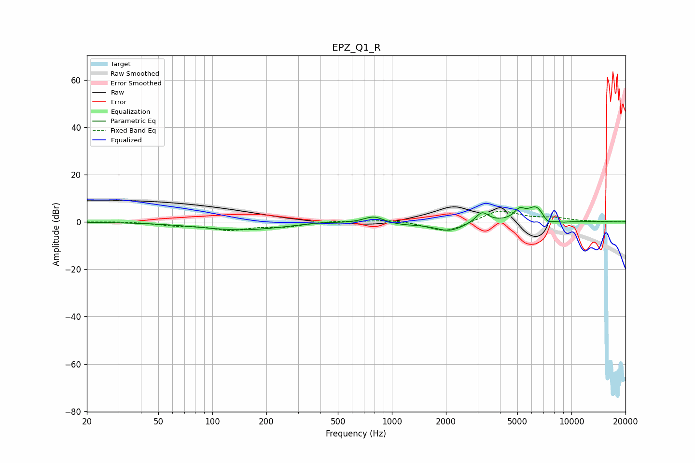

# EPZ_Q1_R
See [usage instructions](https://github.com/jaakkopasanen/AutoEq#usage) for more options and info.

### Parametric EQs
Apply preamp of -6.5 dB when using parametric equalizer.

|   # | Type    |   Fc (Hz) |    Q |   Gain (dB) |
|-----|---------|-----------|------|-------------|
|   1 | Peaking |       145 | 0.6  |        -3.3 |
|   2 | Peaking |       389 | 1.66 |         0.6 |
|   3 | Peaking |       793 | 2.57 |         3   |
|   4 | Peaking |      1118 | 1.37 |        -1   |
|   5 | Peaking |      2088 | 1.77 |        -3.8 |
|   6 | Peaking |      3175 | 4.02 |         4.6 |
|   7 | Peaking |      5132 | 4.71 |         3.9 |
|   8 | Peaking |      6366 | 2.79 |         6.6 |
|   9 | Peaking |      7370 | 4.49 |        -2.8 |
|  10 | Peaking |      8853 | 3.16 |        -0.7 |

### Fixed Band EQs
When using fixed band (also called graphic) equalizer, apply preamp of **-4.7 dB** (if available) and set gains manually with these parameters.

|   # | Type    |   Fc (Hz) |    Q |   Gain (dB) |
|-----|---------|-----------|------|-------------|
|   1 | Peaking |        31 | 1.41 |         0.2 |
|   2 | Peaking |        62 | 1.41 |        -1.2 |
|   3 | Peaking |       125 | 1.41 |        -3.1 |
|   4 | Peaking |       250 | 1.41 |        -1.8 |
|   5 | Peaking |       500 | 1.41 |         0.6 |
|   6 | Peaking |      1000 | 1.41 |         1   |
|   7 | Peaking |      2000 | 1.41 |        -4.6 |
|   8 | Peaking |      4000 | 1.41 |         5.1 |
|   9 | Peaking |      8000 | 1.41 |         1.4 |
|  10 | Peaking |     16000 | 1.41 |         0.1 |

### Graphs

