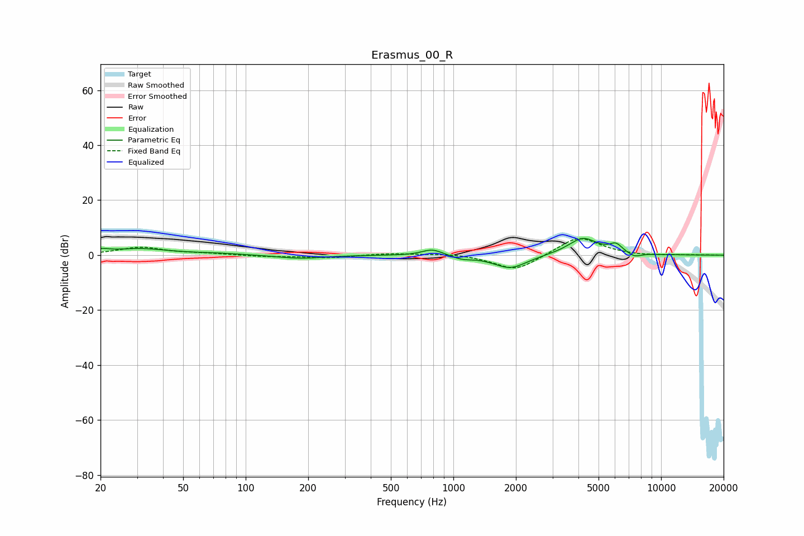

# Erasmus_00_R
See [usage instructions](https://github.com/jaakkopasanen/AutoEq#usage) for more options and info.

### Parametric EQs
Apply preamp of -6.1 dB when using parametric equalizer.

|   # | Type    |   Fc (Hz) |    Q |   Gain (dB) |
|-----|---------|-----------|------|-------------|
|   1 | Peaking |        20 | 3.81 |         1.2 |
|   2 | Peaking |        31 | 1.02 |         2.3 |
|   3 | Peaking |        73 | 1.23 |         0.5 |
|   4 | Peaking |       183 | 1.3  |        -1.2 |
|   5 | Peaking |       792 | 2.84 |         2.4 |
|   6 | Peaking |      1103 | 3.13 |        -1.1 |
|   7 | Peaking |      1881 | 1.74 |        -5   |
|   8 | Peaking |      4209 | 1.92 |         6.3 |
|   9 | Peaking |      6064 | 4.53 |         2.9 |
|  10 | Peaking |      7459 | 4.31 |        -1.5 |

### Fixed Band EQs
When using fixed band (also called graphic) equalizer, apply preamp of **-6.1 dB** (if available) and set gains manually with these parameters.

|   # | Type    |   Fc (Hz) |    Q |   Gain (dB) |
|-----|---------|-----------|------|-------------|
|   1 | Peaking |        31 | 1.41 |         2.8 |
|   2 | Peaking |        62 | 1.41 |         0.5 |
|   3 | Peaking |       125 | 1.41 |        -0.5 |
|   4 | Peaking |       250 | 1.41 |        -1   |
|   5 | Peaking |       500 | 1.41 |         0.7 |
|   6 | Peaking |      1000 | 1.41 |         0.7 |
|   7 | Peaking |      2000 | 1.41 |        -6   |
|   8 | Peaking |      4000 | 1.41 |         7.1 |
|   9 | Peaking |      8000 | 1.41 |        -0.4 |
|  10 | Peaking |     16000 | 1.41 |         0.1 |

### Graphs

