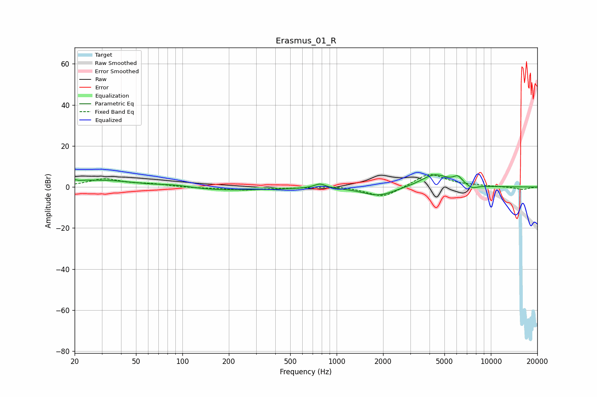

# Erasmus_01_R
See [usage instructions](https://github.com/jaakkopasanen/AutoEq#usage) for more options and info.

### Parametric EQs
Apply preamp of -6.0 dB when using parametric equalizer.

|   # | Type    |   Fc (Hz) |    Q |   Gain (dB) |
|-----|---------|-----------|------|-------------|
|   1 | Peaking |        21 | 4.55 |         3.2 |
|   2 | Peaking |        21 | 5.92 |        -2.4 |
|   3 | Peaking |        31 | 0.67 |         3.3 |
|   4 | Peaking |        89 | 1.24 |         1.3 |
|   5 | Peaking |       176 | 0.44 |        -1.8 |
|   6 | Peaking |       780 | 3.77 |         2.2 |
|   7 | Peaking |      1881 | 1.35 |        -4.4 |
|   8 | Peaking |      4317 | 1.56 |         6.3 |
|   9 | Peaking |      6113 | 4.57 |         3.5 |
|  10 | Peaking |      7568 | 3.63 |        -1.8 |

### Fixed Band EQs
When using fixed band (also called graphic) equalizer, apply preamp of **-6.1 dB** (if available) and set gains manually with these parameters.

|   # | Type    |   Fc (Hz) |    Q |   Gain (dB) |
|-----|---------|-----------|------|-------------|
|   1 | Peaking |        31 | 1.41 |         3.8 |
|   2 | Peaking |        62 | 1.41 |         1.2 |
|   3 | Peaking |       125 | 1.41 |        -0.4 |
|   4 | Peaking |       250 | 1.41 |        -1.4 |
|   5 | Peaking |       500 | 1.41 |        -0.4 |
|   6 | Peaking |      1000 | 1.41 |         0.7 |
|   7 | Peaking |      2000 | 1.41 |        -5.4 |
|   8 | Peaking |      4000 | 1.41 |         6.9 |
|   9 | Peaking |      8000 | 1.41 |         0.4 |
|  10 | Peaking |     16000 | 1.41 |        -1.3 |

### Graphs

