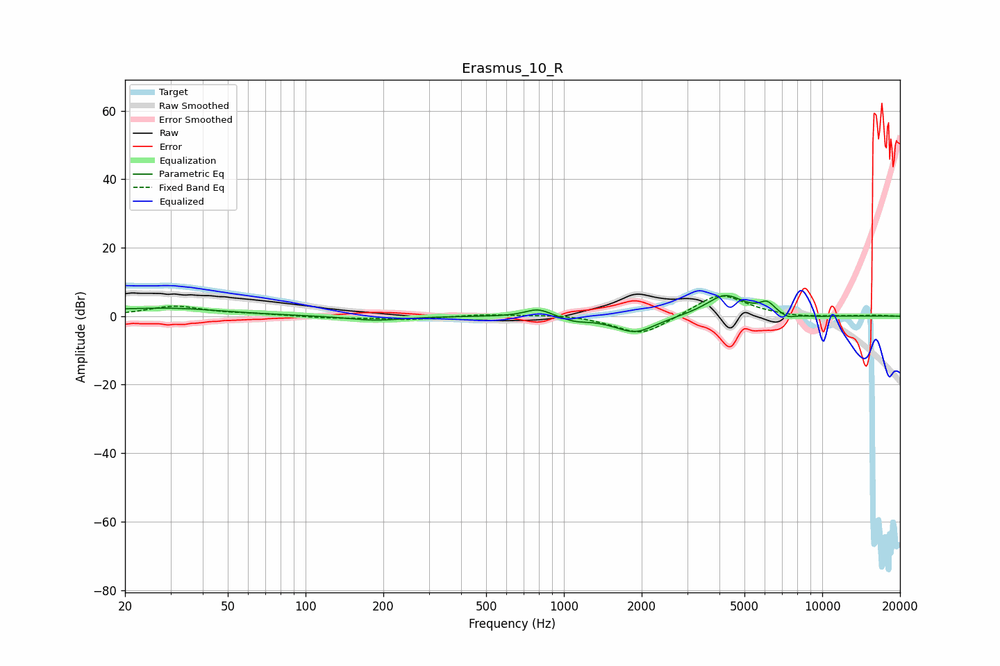

# Erasmus_10_R
See [usage instructions](https://github.com/jaakkopasanen/AutoEq#usage) for more options and info.

### Parametric EQs
Apply preamp of -6.1 dB when using parametric equalizer.

|   # | Type    |   Fc (Hz) |    Q |   Gain (dB) |
|-----|---------|-----------|------|-------------|
|   1 | Peaking |        20 | 4.43 |         0.2 |
|   2 | Peaking |        28 | 0.65 |         2.3 |
|   3 | Peaking |       186 | 1.39 |        -1.3 |
|   4 | Peaking |       795 | 2.83 |         2.4 |
|   5 | Peaking |      1101 | 2.89 |        -1.1 |
|   6 | Peaking |      1887 | 1.71 |        -5   |
|   7 | Peaking |      4204 | 1.87 |         6.3 |
|   8 | Peaking |      6120 | 4.62 |         3   |
|   9 | Peaking |      7354 | 4.28 |        -1.3 |
|  10 | Peaking |      9504 | 2.01 |        -0.3 |

### Fixed Band EQs
When using fixed band (also called graphic) equalizer, apply preamp of **-6.0 dB** (if available) and set gains manually with these parameters.

|   # | Type    |   Fc (Hz) |    Q |   Gain (dB) |
|-----|---------|-----------|------|-------------|
|   1 | Peaking |        31 | 1.41 |         2.8 |
|   2 | Peaking |        62 | 1.41 |         0.5 |
|   3 | Peaking |       125 | 1.41 |        -0.5 |
|   4 | Peaking |       250 | 1.41 |        -1   |
|   5 | Peaking |       500 | 1.41 |         0.6 |
|   6 | Peaking |      1000 | 1.41 |         0.6 |
|   7 | Peaking |      2000 | 1.41 |        -5.9 |
|   8 | Peaking |      4000 | 1.41 |         7   |
|   9 | Peaking |      8000 | 1.41 |        -0.5 |
|  10 | Peaking |     16000 | 1.41 |         0.2 |

### Graphs

