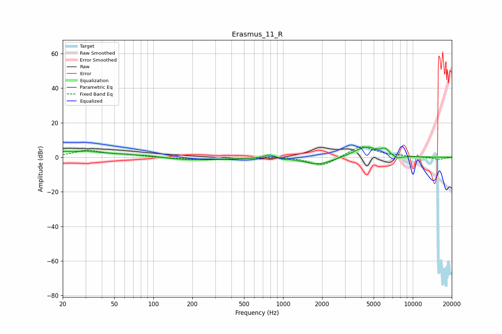

# Erasmus_11_R
See [usage instructions](https://github.com/jaakkopasanen/AutoEq#usage) for more options and info.

### Parametric EQs
Apply preamp of -6.0 dB when using parametric equalizer.

|   # | Type    |   Fc (Hz) |    Q |   Gain (dB) |
|-----|---------|-----------|------|-------------|
|   1 | Peaking |        20 | 0.25 |         3.5 |
|   2 | Peaking |        32 | 5.37 |         3.1 |
|   3 | Peaking |        32 | 5.98 |        -2.6 |
|   4 | Peaking |        95 | 1.3  |         0.7 |
|   5 | Peaking |       169 | 0.46 |        -2   |
|   6 | Peaking |       782 | 3.58 |         2.1 |
|   7 | Peaking |      1883 | 1.27 |        -4.4 |
|   8 | Peaking |      4354 | 1.46 |         6.4 |
|   9 | Peaking |      6111 | 4.79 |         3   |
|  10 | Peaking |      7649 | 3.86 |        -1.8 |

### Fixed Band EQs
When using fixed band (also called graphic) equalizer, apply preamp of **-6.1 dB** (if available) and set gains manually with these parameters.

|   # | Type    |   Fc (Hz) |    Q |   Gain (dB) |
|-----|---------|-----------|------|-------------|
|   1 | Peaking |        31 | 1.41 |         3.9 |
|   2 | Peaking |        62 | 1.41 |         1.2 |
|   3 | Peaking |       125 | 1.41 |        -0.4 |
|   4 | Peaking |       250 | 1.41 |        -1.4 |
|   5 | Peaking |       500 | 1.41 |        -0.4 |
|   6 | Peaking |      1000 | 1.41 |         0.7 |
|   7 | Peaking |      2000 | 1.41 |        -5.4 |
|   8 | Peaking |      4000 | 1.41 |         6.9 |
|   9 | Peaking |      8000 | 1.41 |         0.5 |
|  10 | Peaking |     16000 | 1.41 |        -1.3 |

### Graphs

