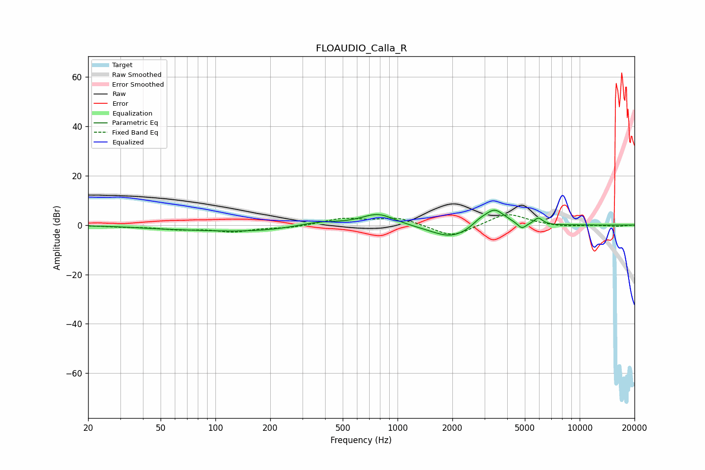

# FLOAUDIO_Calla_R
See [usage instructions](https://github.com/jaakkopasanen/AutoEq#usage) for more options and info.

### Parametric EQs
Apply preamp of -6.1 dB when using parametric equalizer.

|   # | Type    |   Fc (Hz) |    Q |   Gain (dB) |
|-----|---------|-----------|------|-------------|
|   1 | Peaking |        49 | 0.9  |        -0.5 |
|   2 | Peaking |       154 | 0.41 |        -2.7 |
|   3 | Peaking |       364 | 1.14 |         2.2 |
|   4 | Peaking |       782 | 1.53 |         4.9 |
|   5 | Peaking |      1974 | 1.65 |        -1.1 |
|   6 | Peaking |      1976 | 1.14 |        -4.4 |
|   7 | Peaking |      2819 | 3.56 |         1.7 |
|   8 | Peaking |      3402 | 2.37 |         7.2 |
|   9 | Peaking |      4815 | 5.96 |        -2.5 |
|  10 | Peaking |      5927 | 6    |         2.7 |

### Fixed Band EQs
When using fixed band (also called graphic) equalizer, apply preamp of **-4.2 dB** (if available) and set gains manually with these parameters.

|   # | Type    |   Fc (Hz) |    Q |   Gain (dB) |
|-----|---------|-----------|------|-------------|
|   1 | Peaking |        31 | 1.41 |        -0.6 |
|   2 | Peaking |        62 | 1.41 |        -1.5 |
|   3 | Peaking |       125 | 1.41 |        -2.5 |
|   4 | Peaking |       250 | 1.41 |        -1   |
|   5 | Peaking |       500 | 1.41 |         2.6 |
|   6 | Peaking |      1000 | 1.41 |         3.1 |
|   7 | Peaking |      2000 | 1.41 |        -5.1 |
|   8 | Peaking |      4000 | 1.41 |         5   |
|   9 | Peaking |      8000 | 1.41 |        -0.8 |
|  10 | Peaking |     16000 | 1.41 |        -0.5 |

### Graphs

