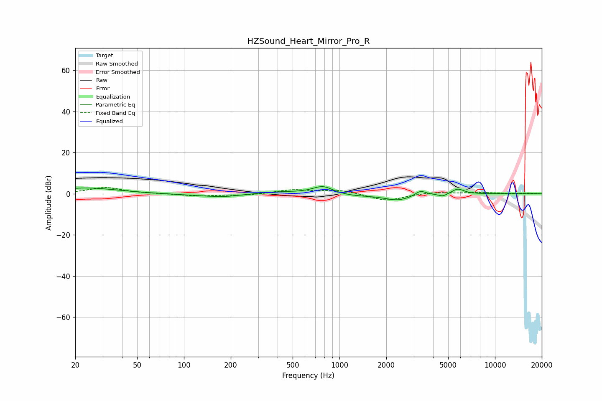

# HZSound_Heart_Mirror_Pro_R
See [usage instructions](https://github.com/jaakkopasanen/AutoEq#usage) for more options and info.

### Parametric EQs
Apply preamp of -3.6 dB when using parametric equalizer.

|   # | Type    |   Fc (Hz) |    Q |   Gain (dB) |
|-----|---------|-----------|------|-------------|
|   1 | Peaking |        24 | 0.71 |         2.8 |
|   2 | Peaking |       169 | 0.71 |        -1.4 |
|   3 | Peaking |       181 | 1.89 |        -0.4 |
|   4 | Peaking |       380 | 0.95 |         1.2 |
|   5 | Peaking |       781 | 2.16 |         3.9 |
|   6 | Peaking |      1215 | 1.13 |        -1.1 |
|   7 | Peaking |      2378 | 1.58 |        -3   |
|   8 | Peaking |      3319 | 4.18 |         2.5 |
|   9 | Peaking |      4626 | 5.01 |        -1.4 |
|  10 | Peaking |      5772 | 3.54 |         2.6 |

### Fixed Band EQs
When using fixed band (also called graphic) equalizer, apply preamp of **-3.1 dB** (if available) and set gains manually with these parameters.

|   # | Type    |   Fc (Hz) |    Q |   Gain (dB) |
|-----|---------|-----------|------|-------------|
|   1 | Peaking |        31 | 1.41 |         3   |
|   2 | Peaking |        62 | 1.41 |        -0   |
|   3 | Peaking |       125 | 1.41 |        -1.1 |
|   4 | Peaking |       250 | 1.41 |        -0.7 |
|   5 | Peaking |       500 | 1.41 |         1.9 |
|   6 | Peaking |      1000 | 1.41 |         1.8 |
|   7 | Peaking |      2000 | 1.41 |        -3.5 |
|   8 | Peaking |      4000 | 1.41 |         0.8 |
|   9 | Peaking |      8000 | 1.41 |         0.5 |
|  10 | Peaking |     16000 | 1.41 |         0.3 |

### Graphs

