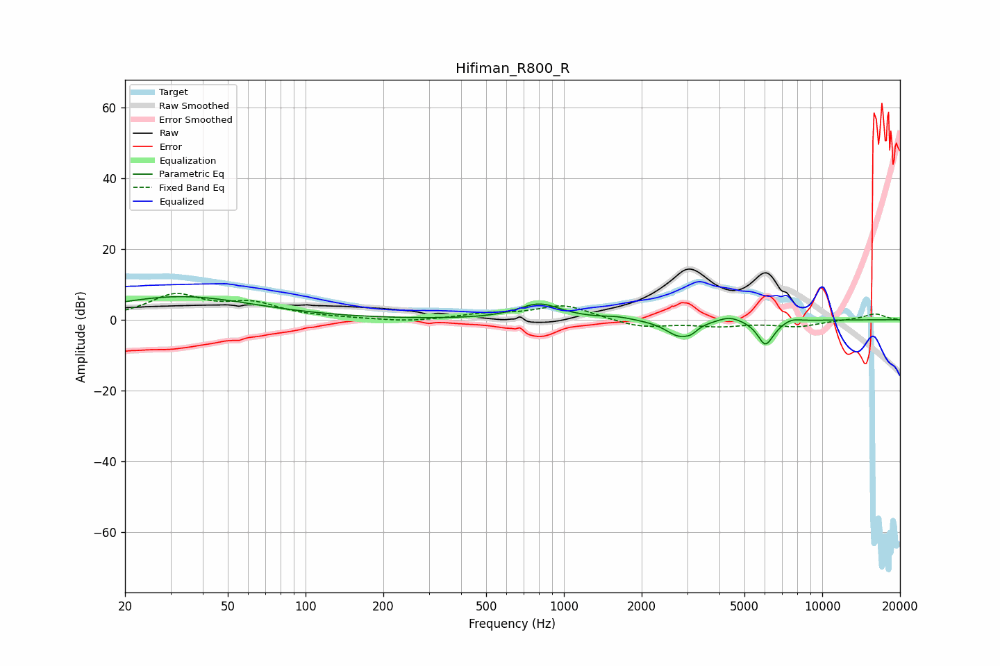

# Hifiman_R800_R
See [usage instructions](https://github.com/jaakkopasanen/AutoEq#usage) for more options and info.

### Parametric EQs
Apply preamp of -6.6 dB when using parametric equalizer.

|   # | Type    |   Fc (Hz) |    Q |   Gain (dB) |
|-----|---------|-----------|------|-------------|
|   1 | Peaking |        33 | 0.49 |         6.5 |
|   2 | Peaking |       804 | 1.7  |         4.4 |
|   3 | Peaking |      1614 | 2.6  |         0.7 |
|   4 | Peaking |      2799 | 2.61 |        -4.9 |
|   5 | Peaking |      3068 | 2    |         0.5 |
|   6 | Peaking |      3114 | 6    |        -1.3 |
|   7 | Peaking |      4388 | 3.1  |         1.5 |
|   8 | Peaking |      6011 | 4.53 |        -6.5 |
|   9 | Peaking |      6412 | 3.8  |        -0.8 |
|  10 | Peaking |      7598 | 3.8  |         0.9 |

### Fixed Band EQs
When using fixed band (also called graphic) equalizer, apply preamp of **-7.5 dB** (if available) and set gains manually with these parameters.

|   # | Type    |   Fc (Hz) |    Q |   Gain (dB) |
|-----|---------|-----------|------|-------------|
|   1 | Peaking |        31 | 1.41 |         6.7 |
|   2 | Peaking |        62 | 1.41 |         4   |
|   3 | Peaking |       125 | 1.41 |         0.3 |
|   4 | Peaking |       250 | 1.41 |        -0.7 |
|   5 | Peaking |       500 | 1.41 |         1.4 |
|   6 | Peaking |      1000 | 1.41 |         4.1 |
|   7 | Peaking |      2000 | 1.41 |        -2.2 |
|   8 | Peaking |      4000 | 1.41 |        -1.6 |
|   9 | Peaking |      8000 | 1.41 |        -1.8 |
|  10 | Peaking |     16000 | 1.41 |         1.7 |

### Graphs

