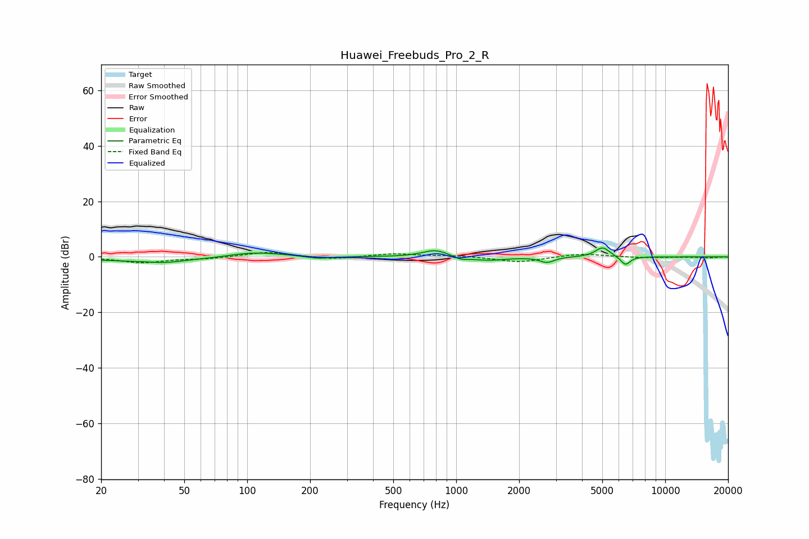

# Huawei_Freebuds_Pro_2_R
See [usage instructions](https://github.com/jaakkopasanen/AutoEq#usage) for more options and info.

### Parametric EQs
Apply preamp of -3.3 dB when using parametric equalizer.

|   # | Type    |   Fc (Hz) |    Q |   Gain (dB) |
|-----|---------|-----------|------|-------------|
|   1 | Peaking |        38 | 0.45 |        -1.7 |
|   2 | Peaking |        41 | 2.27 |        -0.7 |
|   3 | Peaking |       107 | 1    |         2.2 |
|   4 | Peaking |       218 | 2.53 |        -0.9 |
|   5 | Peaking |       793 | 2.31 |         2.6 |
|   6 | Peaking |      1056 | 4.46 |        -1.1 |
|   7 | Peaking |      1415 | 1.68 |        -1.3 |
|   8 | Peaking |      2720 | 4.2  |        -1.9 |
|   9 | Peaking |      5019 | 4.08 |         3.5 |
|  10 | Peaking |      6452 | 6    |        -3.2 |

### Fixed Band EQs
When using fixed band (also called graphic) equalizer, apply preamp of **-1.6 dB** (if available) and set gains manually with these parameters.

|   # | Type    |   Fc (Hz) |    Q |   Gain (dB) |
|-----|---------|-----------|------|-------------|
|   1 | Peaking |        31 | 1.41 |        -2   |
|   2 | Peaking |        62 | 1.41 |        -0.7 |
|   3 | Peaking |       125 | 1.41 |         1.8 |
|   4 | Peaking |       250 | 1.41 |        -1   |
|   5 | Peaking |       500 | 1.41 |         1.2 |
|   6 | Peaking |      1000 | 1.41 |         0.4 |
|   7 | Peaking |      2000 | 1.41 |        -2   |
|   8 | Peaking |      4000 | 1.41 |         1.2 |
|   9 | Peaking |      8000 | 1.41 |        -0.3 |
|  10 | Peaking |     16000 | 1.41 |        -0.3 |

### Graphs

