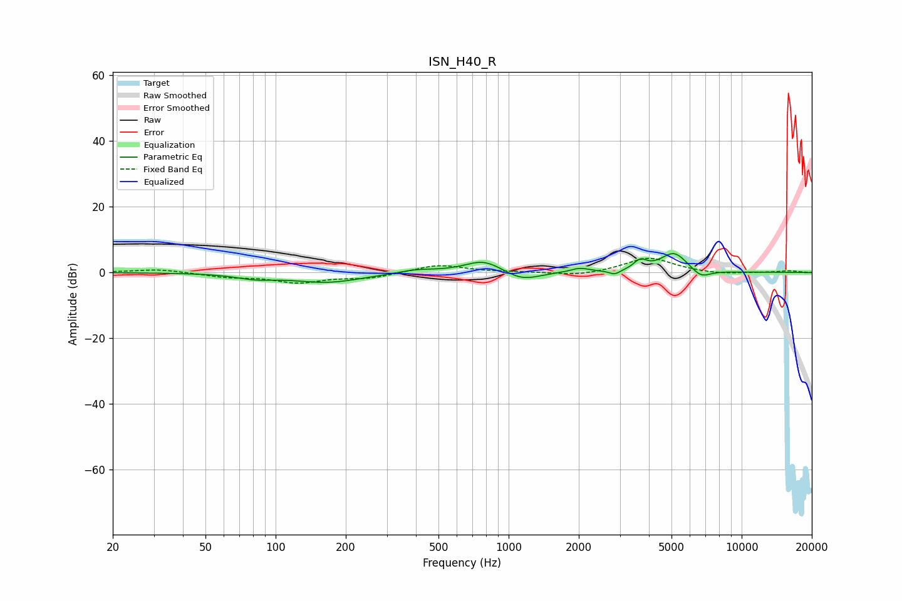

# ISN_H40_R
See [usage instructions](https://github.com/jaakkopasanen/AutoEq#usage) for more options and info.

### Parametric EQs
Apply preamp of -5.8 dB when using parametric equalizer.

|   # | Type    |   Fc (Hz) |    Q |   Gain (dB) |
|-----|---------|-----------|------|-------------|
|   1 | Peaking |        82 | 1.75 |        -1.3 |
|   2 | Peaking |       167 | 0.93 |        -2.9 |
|   3 | Peaking |       401 | 1.72 |         1.1 |
|   4 | Peaking |       782 | 1.74 |         4   |
|   5 | Peaking |      1140 | 1.87 |        -2.9 |
|   6 | Peaking |      2020 | 3.5  |         1.3 |
|   7 | Peaking |      2853 | 6    |        -1.4 |
|   8 | Peaking |      3668 | 5.25 |         2.8 |
|   9 | Peaking |      5131 | 2.33 |         6.2 |
|  10 | Peaking |      6677 | 3.18 |        -2.7 |

### Fixed Band EQs
When using fixed band (also called graphic) equalizer, apply preamp of **-4.4 dB** (if available) and set gains manually with these parameters.

|   # | Type    |   Fc (Hz) |    Q |   Gain (dB) |
|-----|---------|-----------|------|-------------|
|   1 | Peaking |        31 | 1.41 |         1.1 |
|   2 | Peaking |        62 | 1.41 |        -1.2 |
|   3 | Peaking |       125 | 1.41 |        -2.8 |
|   4 | Peaking |       250 | 1.41 |        -1.6 |
|   5 | Peaking |       500 | 1.41 |         2.4 |
|   6 | Peaking |      1000 | 1.41 |         0.1 |
|   7 | Peaking |      2000 | 1.41 |        -1.1 |
|   8 | Peaking |      4000 | 1.41 |         4.6 |
|   9 | Peaking |      8000 | 1.41 |        -0.6 |
|  10 | Peaking |     16000 | 1.41 |         0.5 |

### Graphs

