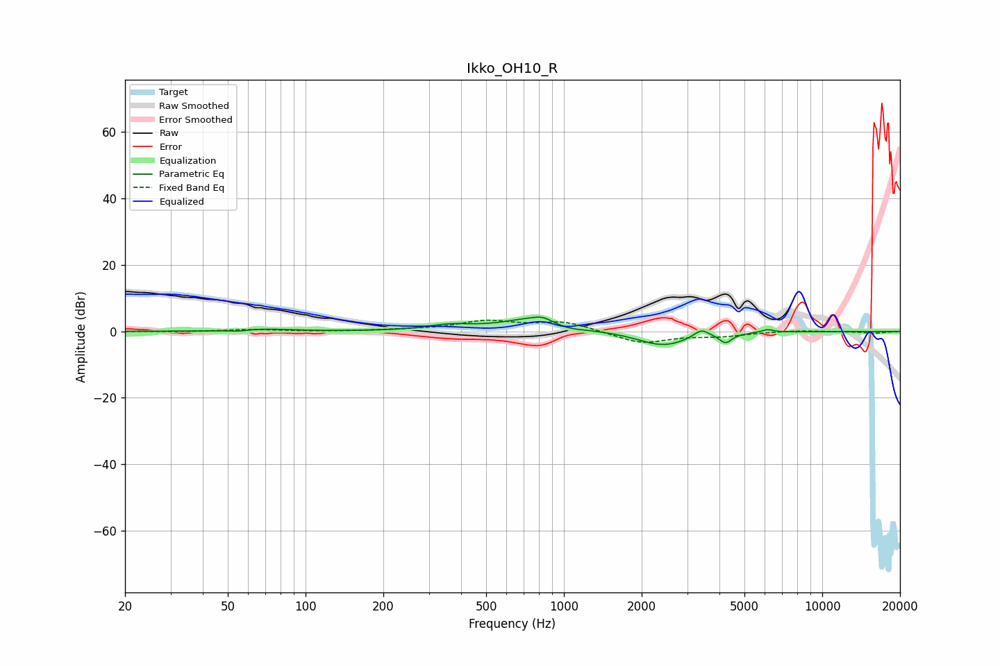

# Ikko_OH10_R
See [usage instructions](https://github.com/jaakkopasanen/AutoEq#usage) for more options and info.

### Parametric EQs
Apply preamp of -4.4 dB when using parametric equalizer.

|   # | Type    |   Fc (Hz) |    Q |   Gain (dB) |
|-----|---------|-----------|------|-------------|
|   1 | Peaking |        55 | 3.35 |        -0.5 |
|   2 | Peaking |        66 | 1.4  |         0.8 |
|   3 | Peaking |       360 | 1.66 |         1.5 |
|   4 | Peaking |       792 | 1.16 |         4.3 |
|   5 | Peaking |       827 | 4.47 |         1   |
|   6 | Peaking |      1021 | 2.02 |        -1.6 |
|   7 | Peaking |      2420 | 1.42 |        -4.4 |
|   8 | Peaking |      3402 | 4.87 |         2.4 |
|   9 | Peaking |      4226 | 5.83 |        -2.8 |
|  10 | Peaking |      6149 | 6    |         0.9 |

### Fixed Band EQs
When using fixed band (also called graphic) equalizer, apply preamp of **-3.5 dB** (if available) and set gains manually with these parameters.

|   # | Type    |   Fc (Hz) |    Q |   Gain (dB) |
|-----|---------|-----------|------|-------------|
|   1 | Peaking |        31 | 1.41 |        -0.1 |
|   2 | Peaking |        62 | 1.41 |         0.6 |
|   3 | Peaking |       125 | 1.41 |        -0.1 |
|   4 | Peaking |       250 | 1.41 |         0.4 |
|   5 | Peaking |       500 | 1.41 |         2.9 |
|   6 | Peaking |      1000 | 1.41 |         2.9 |
|   7 | Peaking |      2000 | 1.41 |        -3.6 |
|   8 | Peaking |      4000 | 1.41 |        -1.3 |
|   9 | Peaking |      8000 | 1.41 |         0.4 |
|  10 | Peaking |     16000 | 1.41 |        -0.5 |

### Graphs

