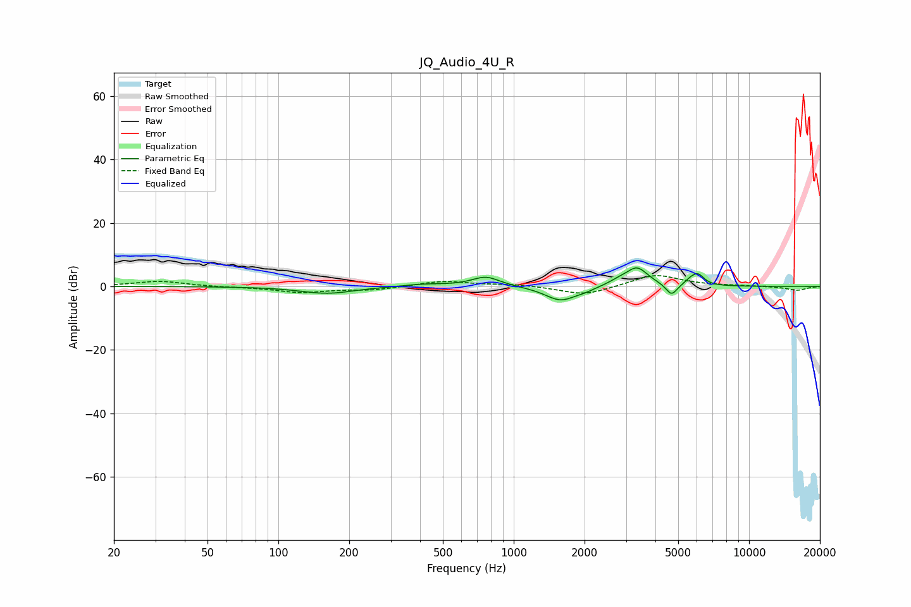

# JQ_Audio_4U_R
See [usage instructions](https://github.com/jaakkopasanen/AutoEq#usage) for more options and info.

### Parametric EQs
Apply preamp of -5.9 dB when using parametric equalizer.

|   # | Type    |   Fc (Hz) |    Q |   Gain (dB) |
|-----|---------|-----------|------|-------------|
|   1 | Peaking |       161 | 1.25 |        -2.2 |
|   2 | Peaking |       418 | 1.55 |         0.8 |
|   3 | Peaking |       761 | 2.36 |         3.1 |
|   4 | Peaking |      1582 | 2.12 |        -4.6 |
|   5 | Peaking |      2003 | 3.44 |        -0.7 |
|   6 | Peaking |      2778 | 3.13 |         1.1 |
|   7 | Peaking |      3339 | 2.94 |         5.8 |
|   8 | Peaking |      4682 | 5.84 |        -3.7 |
|   9 | Peaking |      5609 | 6    |         1.2 |
|  10 | Peaking |      6059 | 5.16 |         3.4 |

### Fixed Band EQs
When using fixed band (also called graphic) equalizer, apply preamp of **-3.5 dB** (if available) and set gains manually with these parameters.

|   # | Type    |   Fc (Hz) |    Q |   Gain (dB) |
|-----|---------|-----------|------|-------------|
|   1 | Peaking |        31 | 1.41 |         1.7 |
|   2 | Peaking |        62 | 1.41 |        -0.2 |
|   3 | Peaking |       125 | 1.41 |        -1.8 |
|   4 | Peaking |       250 | 1.41 |        -1.1 |
|   5 | Peaking |       500 | 1.41 |         1.7 |
|   6 | Peaking |      1000 | 1.41 |         0.7 |
|   7 | Peaking |      2000 | 1.41 |        -2.9 |
|   8 | Peaking |      4000 | 1.41 |         3.8 |
|   9 | Peaking |      8000 | 1.41 |         0.2 |
|  10 | Peaking |     16000 | 1.41 |        -1.2 |

### Graphs

