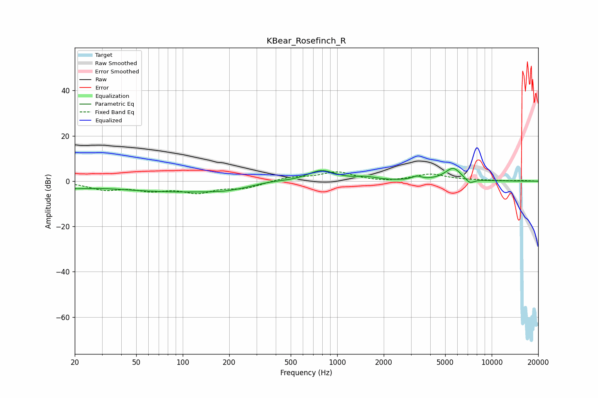

# KBear_Rosefinch_R
See [usage instructions](https://github.com/jaakkopasanen/AutoEq#usage) for more options and info.

### Parametric EQs
Apply preamp of -5.7 dB when using parametric equalizer.

|   # | Type    |   Fc (Hz) |    Q |   Gain (dB) |
|-----|---------|-----------|------|-------------|
|   1 | Peaking |        20 | 4.78 |        -0.9 |
|   2 | Peaking |        23 | 2    |        -0.9 |
|   3 | Peaking |        99 | 0.27 |        -4.7 |
|   4 | Peaking |       190 | 1.21 |        -0.8 |
|   5 | Peaking |       367 | 1.11 |         1.5 |
|   6 | Peaking |       787 | 1.55 |         5.1 |
|   7 | Peaking |      1532 | 2.08 |         1.4 |
|   8 | Peaking |      3273 | 4.81 |         1.5 |
|   9 | Peaking |      5633 | 2.57 |         5.8 |
|  10 | Peaking |      7197 | 4.47 |        -2.3 |

### Fixed Band EQs
When using fixed band (also called graphic) equalizer, apply preamp of **-4.2 dB** (if available) and set gains manually with these parameters.

|   # | Type    |   Fc (Hz) |    Q |   Gain (dB) |
|-----|---------|-----------|------|-------------|
|   1 | Peaking |        31 | 1.41 |        -3.4 |
|   2 | Peaking |        62 | 1.41 |        -3.3 |
|   3 | Peaking |       125 | 1.41 |        -4.4 |
|   4 | Peaking |       250 | 1.41 |        -2.8 |
|   5 | Peaking |       500 | 1.41 |         1.7 |
|   6 | Peaking |      1000 | 1.41 |         3.9 |
|   7 | Peaking |      2000 | 1.41 |        -0.6 |
|   8 | Peaking |      4000 | 1.41 |         3   |
|   9 | Peaking |      8000 | 1.41 |         0.3 |
|  10 | Peaking |     16000 | 1.41 |         0.2 |

### Graphs

