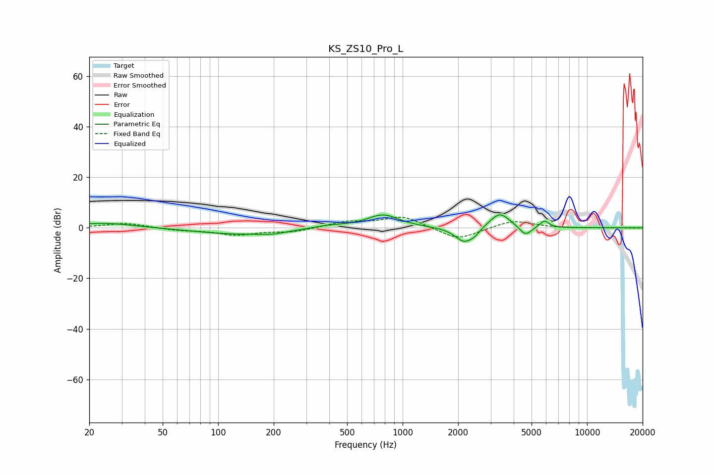

# KS_ZS10_Pro_L
See [usage instructions](https://github.com/jaakkopasanen/AutoEq#usage) for more options and info.

### Parametric EQs
Apply preamp of -5.2 dB when using parametric equalizer.

|   # | Type    |   Fc (Hz) |    Q |   Gain (dB) |
|-----|---------|-----------|------|-------------|
|   1 | Peaking |        24 | 0.86 |         2   |
|   2 | Peaking |       134 | 0.57 |        -2.6 |
|   3 | Peaking |       197 | 2.28 |        -0.8 |
|   4 | Peaking |       399 | 1.39 |         1.1 |
|   5 | Peaking |       783 | 1.63 |         5.2 |
|   6 | Peaking |      2152 | 2.83 |        -5.9 |
|   7 | Peaking |      2454 | 4.97 |        -1.8 |
|   8 | Peaking |      3365 | 2.51 |         6.3 |
|   9 | Peaking |      4627 | 4.23 |        -3.9 |
|  10 | Peaking |      5863 | 5.76 |         2.8 |

### Fixed Band EQs
When using fixed band (also called graphic) equalizer, apply preamp of **-4.3 dB** (if available) and set gains manually with these parameters.

|   # | Type    |   Fc (Hz) |    Q |   Gain (dB) |
|-----|---------|-----------|------|-------------|
|   1 | Peaking |        31 | 1.41 |         1.9 |
|   2 | Peaking |        62 | 1.41 |        -0.9 |
|   3 | Peaking |       125 | 1.41 |        -2.6 |
|   4 | Peaking |       250 | 1.41 |        -1.6 |
|   5 | Peaking |       500 | 1.41 |         2.3 |
|   6 | Peaking |      1000 | 1.41 |         4.6 |
|   7 | Peaking |      2000 | 1.41 |        -5   |
|   8 | Peaking |      4000 | 1.41 |         3.1 |
|   9 | Peaking |      8000 | 1.41 |        -0.2 |
|  10 | Peaking |     16000 | 1.41 |        -0   |

### Graphs

