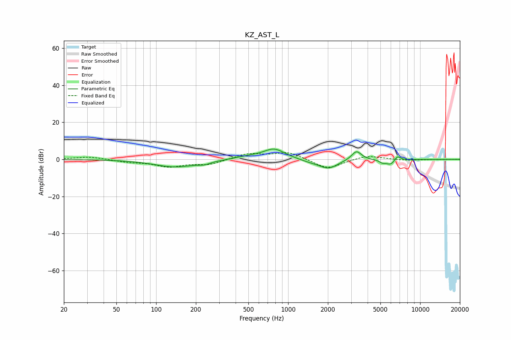

# KZ_AST_L
See [usage instructions](https://github.com/jaakkopasanen/AutoEq#usage) for more options and info.

### Parametric EQs
Apply preamp of -5.6 dB when using parametric equalizer.

|   # | Type    |   Fc (Hz) |    Q |   Gain (dB) |
|-----|---------|-----------|------|-------------|
|   1 | Peaking |       140 | 0.89 |        -4.1 |
|   2 | Peaking |       232 | 3.33 |        -1.2 |
|   3 | Peaking |       484 | 1.52 |         1.2 |
|   4 | Peaking |       782 | 1.67 |         5.8 |
|   5 | Peaking |      1473 | 1.67 |        -1.1 |
|   6 | Peaking |      2022 | 1.98 |        -4.8 |
|   7 | Peaking |      3293 | 3.78 |         5.1 |
|   8 | Peaking |      5182 | 6    |        -1.4 |
|   9 | Peaking |      5978 | 4.07 |        -2.9 |
|  10 | Peaking |      6729 | 6    |         2.6 |

### Fixed Band EQs
When using fixed band (also called graphic) equalizer, apply preamp of **-3.7 dB** (if available) and set gains manually with these parameters.

|   # | Type    |   Fc (Hz) |    Q |   Gain (dB) |
|-----|---------|-----------|------|-------------|
|   1 | Peaking |        31 | 1.41 |         1.5 |
|   2 | Peaking |        62 | 1.41 |        -1.2 |
|   3 | Peaking |       125 | 1.41 |        -3.7 |
|   4 | Peaking |       250 | 1.41 |        -2.7 |
|   5 | Peaking |       500 | 1.41 |         3.1 |
|   6 | Peaking |      1000 | 1.41 |         4   |
|   7 | Peaking |      2000 | 1.41 |        -5.4 |
|   8 | Peaking |      4000 | 1.41 |         2.3 |
|   9 | Peaking |      8000 | 1.41 |        -0.5 |
|  10 | Peaking |     16000 | 1.41 |        -0   |

### Graphs

