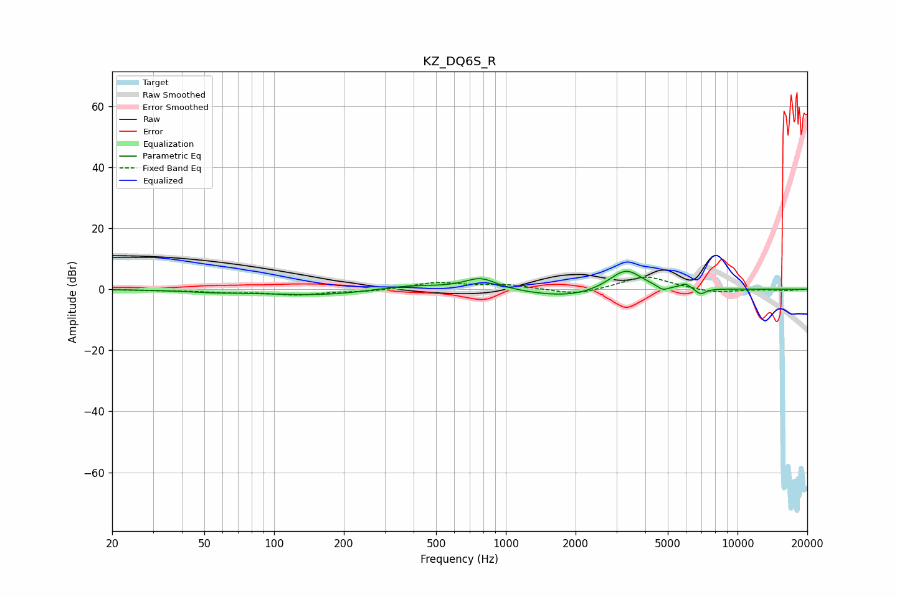

# KZ_DQ6S_R
See [usage instructions](https://github.com/jaakkopasanen/AutoEq#usage) for more options and info.

### Parametric EQs
Apply preamp of -6.0 dB when using parametric equalizer.

|   # | Type    |   Fc (Hz) |    Q |   Gain (dB) |
|-----|---------|-----------|------|-------------|
|   1 | Peaking |        54 | 1.15 |        -0.6 |
|   2 | Peaking |       162 | 0.55 |        -2   |
|   3 | Peaking |       374 | 0.94 |         1.8 |
|   4 | Peaking |       779 | 2.03 |         3.8 |
|   5 | Peaking |      1853 | 0.83 |        -2.8 |
|   6 | Peaking |      2990 | 2.02 |         1.2 |
|   7 | Peaking |      3332 | 2.06 |         6.2 |
|   8 | Peaking |      4759 | 5.98 |        -1.5 |
|   9 | Peaking |      5960 | 5.96 |         1.6 |
|  10 | Peaking |      6920 | 6    |        -2   |

### Fixed Band EQs
When using fixed band (also called graphic) equalizer, apply preamp of **-4.0 dB** (if available) and set gains manually with these parameters.

|   # | Type    |   Fc (Hz) |    Q |   Gain (dB) |
|-----|---------|-----------|------|-------------|
|   1 | Peaking |        31 | 1.41 |        -0.3 |
|   2 | Peaking |        62 | 1.41 |        -0.8 |
|   3 | Peaking |       125 | 1.41 |        -1.7 |
|   4 | Peaking |       250 | 1.41 |        -0.7 |
|   5 | Peaking |       500 | 1.41 |         2.1 |
|   6 | Peaking |      1000 | 1.41 |         1.4 |
|   7 | Peaking |      2000 | 1.41 |        -2   |
|   8 | Peaking |      4000 | 1.41 |         4.4 |
|   9 | Peaking |      8000 | 1.41 |        -1.3 |
|  10 | Peaking |     16000 | 1.41 |        -0.4 |

### Graphs

