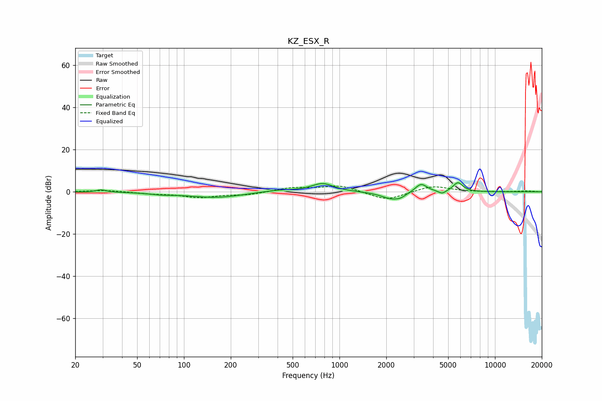

# KZ_ESX_R
See [usage instructions](https://github.com/jaakkopasanen/AutoEq#usage) for more options and info.

### Parametric EQs
Apply preamp of -4.4 dB when using parametric equalizer.

|   # | Type    |   Fc (Hz) |    Q |   Gain (dB) |
|-----|---------|-----------|------|-------------|
|   1 | Peaking |        29 | 4.97 |         1.1 |
|   2 | Peaking |        71 | 1.94 |        -0.7 |
|   3 | Peaking |       159 | 0.81 |        -2.7 |
|   4 | Peaking |       402 | 1.2  |         1   |
|   5 | Peaking |       780 | 2.02 |         4   |
|   6 | Peaking |      2195 | 2.04 |        -3.6 |
|   7 | Peaking |      2486 | 4.89 |        -0.9 |
|   8 | Peaking |      3344 | 3.66 |         4.3 |
|   9 | Peaking |      4578 | 5.81 |        -1.6 |
|  10 | Peaking |      5782 | 4.39 |         4.4 |

### Fixed Band EQs
When using fixed band (also called graphic) equalizer, apply preamp of **-2.8 dB** (if available) and set gains manually with these parameters.

|   # | Type    |   Fc (Hz) |    Q |   Gain (dB) |
|-----|---------|-----------|------|-------------|
|   1 | Peaking |        31 | 1.41 |         0.8 |
|   2 | Peaking |        62 | 1.41 |        -0.8 |
|   3 | Peaking |       125 | 1.41 |        -2.5 |
|   4 | Peaking |       250 | 1.41 |        -1.3 |
|   5 | Peaking |       500 | 1.41 |         1.9 |
|   6 | Peaking |      1000 | 1.41 |         3.1 |
|   7 | Peaking |      2000 | 1.41 |        -4.2 |
|   8 | Peaking |      4000 | 1.41 |         2.9 |
|   9 | Peaking |      8000 | 1.41 |        -0.1 |
|  10 | Peaking |     16000 | 1.41 |         0.4 |

### Graphs

