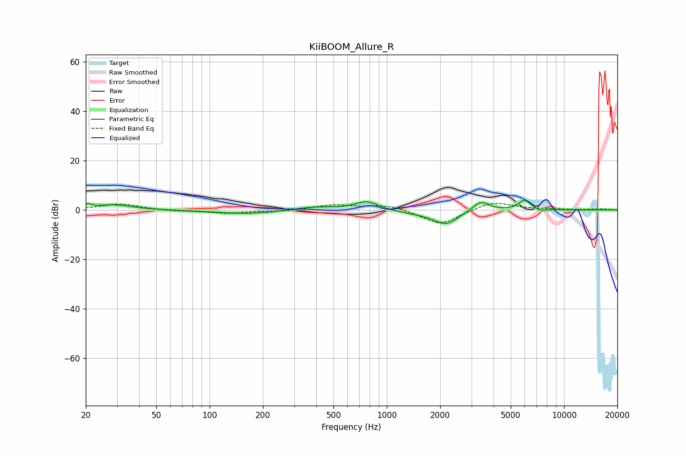

# KiiBOOM_Allure_R
See [usage instructions](https://github.com/jaakkopasanen/AutoEq#usage) for more options and info.

### Parametric EQs
Apply preamp of -4.0 dB when using parametric equalizer.

|   # | Type    |   Fc (Hz) |    Q |   Gain (dB) |
|-----|---------|-----------|------|-------------|
|   1 | Peaking |        20 | 5.93 |         1.6 |
|   2 | Peaking |        29 | 1.4  |         2.1 |
|   3 | Peaking |       165 | 0.77 |        -1.6 |
|   4 | Peaking |       387 | 1.14 |         1.4 |
|   5 | Peaking |       772 | 2.13 |         3.6 |
|   6 | Peaking |      1527 | 0.91 |        -1.1 |
|   7 | Peaking |      2159 | 2.01 |        -5.3 |
|   8 | Peaking |      3389 | 2.98 |         4.2 |
|   9 | Peaking |      5981 | 4.07 |         4   |
|  10 | Peaking |      7426 | 5.97 |        -0.8 |

### Fixed Band EQs
When using fixed band (also called graphic) equalizer, apply preamp of **-2.8 dB** (if available) and set gains manually with these parameters.

|   # | Type    |   Fc (Hz) |    Q |   Gain (dB) |
|-----|---------|-----------|------|-------------|
|   1 | Peaking |        31 | 1.41 |         2.5 |
|   2 | Peaking |        62 | 1.41 |        -0.5 |
|   3 | Peaking |       125 | 1.41 |        -1.3 |
|   4 | Peaking |       250 | 1.41 |        -0.5 |
|   5 | Peaking |       500 | 1.41 |         2   |
|   6 | Peaking |      1000 | 1.41 |         2.2 |
|   7 | Peaking |      2000 | 1.41 |        -6.2 |
|   8 | Peaking |      4000 | 1.41 |         3.6 |
|   9 | Peaking |      8000 | 1.41 |         0.2 |
|  10 | Peaking |     16000 | 1.41 |         0.4 |

### Graphs

